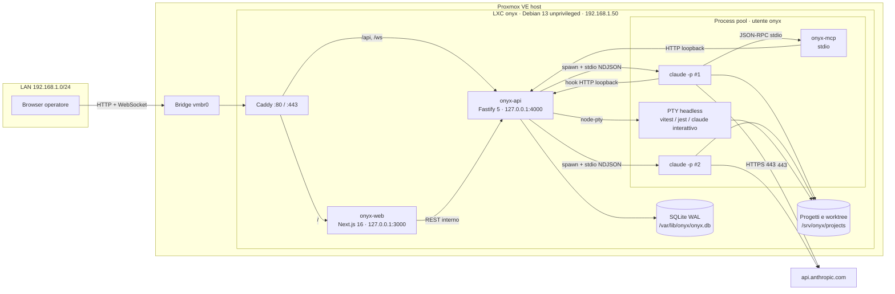
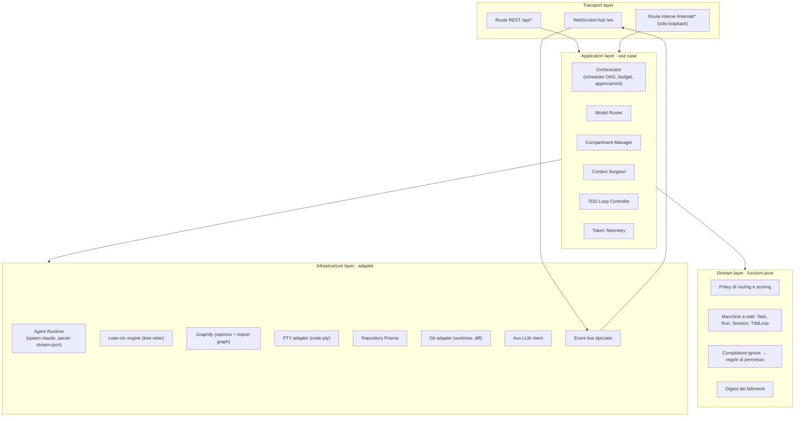
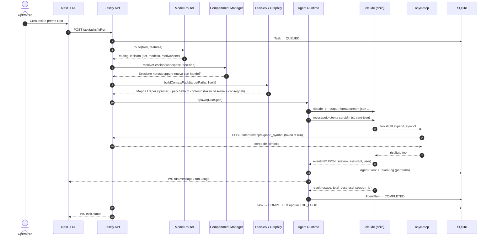
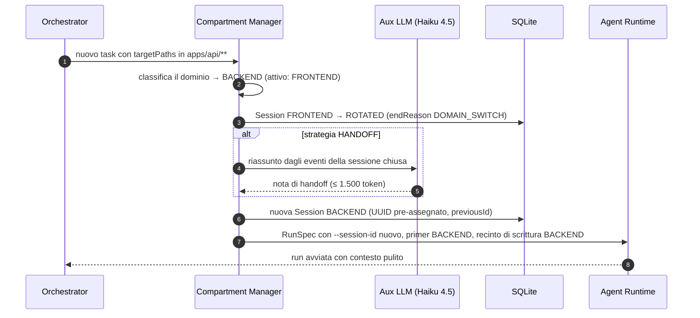
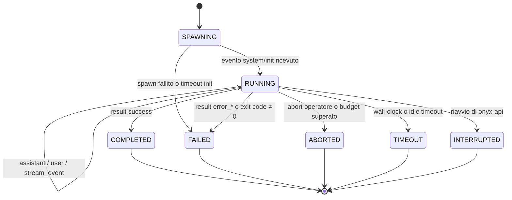
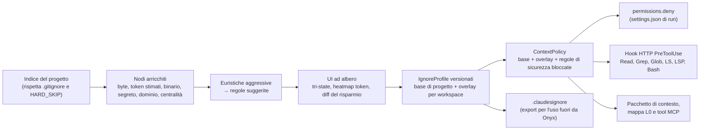
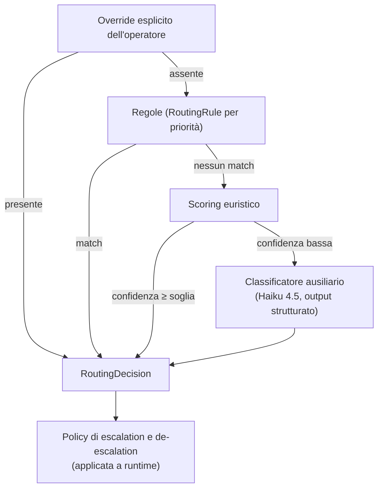
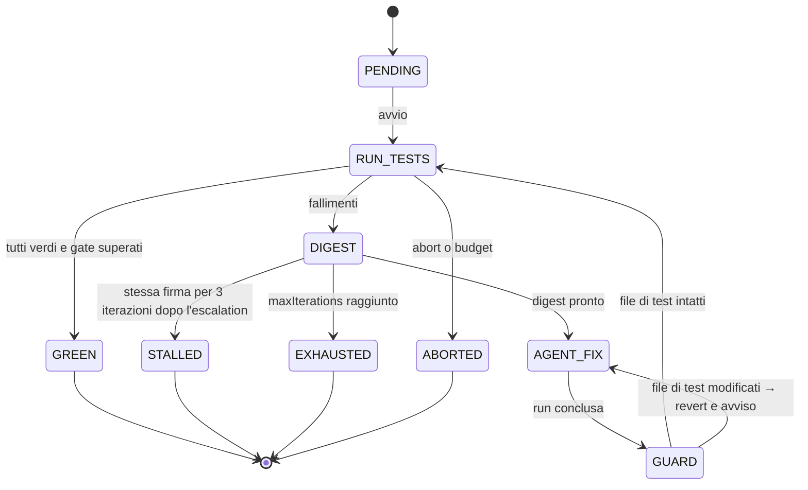
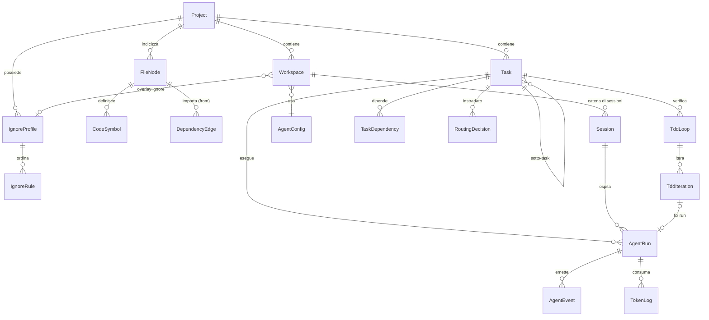

# Onyx — Architecture Document

> Pannello di controllo orchestratore per Claude Code, self-hosted su container LXC (Debian 13) in Proxmox VE.

| Campo | Valore |
|---|---|
| Versione documento | 0.4.0 |
| Data | 2026-10-03 |
| Stato | Fasi 1, 2 e 3 completate (vedi [§16](#16-roadmap-prossimi-step-sequenziali)); Fase 4 da avviare |
| Approccio | Architecture-First, Clean Architecture (ports & adapters) |
| Ambito | Topologia, comunicazione, dati, directory, infrastruttura, rete, roadmap |

---

## Indice

1. [Visione e obiettivi](#1-visione-e-obiettivi)
2. [Requisiti, vincoli e note sullo stack](#2-requisiti-vincoli-e-note-sullo-stack)
3. [Topologia del sistema](#3-topologia-del-sistema)
4. [Schema di comunicazione](#4-schema-di-comunicazione)
5. [Agent Runtime: gestione dei processi child di Claude Code](#5-agent-runtime-gestione-dei-processi-child-di-claude-code)
6. [Moduli core](#6-moduli-core)
7. [Schema del database (Prisma + SQLite)](#7-schema-del-database-prisma--sqlite)
8. [Struttura delle directory](#8-struttura-delle-directory)
9. [Frontend: architettura UI e design system](#9-frontend-architettura-ui-e-design-system)
10. [Infrastruttura LXC e deploy](#10-infrastruttura-lxc-e-deploy)
11. [Rete: IP statico sul container Debian 13](#11-rete-ip-statico-sul-container-debian-13)
12. [Sicurezza](#12-sicurezza)
13. [Osservabilità, resilienza e strategia di test](#13-osservabilità-resilienza-e-strategia-di-test)
14. [Convenzioni di Clean Code](#14-convenzioni-di-clean-code)
15. [Architecture Decision Records](#15-architecture-decision-records)
16. [Roadmap: prossimi step sequenziali](#16-roadmap-prossimi-step-sequenziali)
17. [Decisioni aperte da confermare](#17-decisioni-aperte-da-confermare)
18. [Glossario](#18-glossario)

---

## 1. Visione e obiettivi

Onyx è una web app che orchestra istanze headless di **Claude Code CLI** come processi figli, con tre missioni:

1. **Orchestrare**: accodare task, scomporli in sotto-task, delegarli a sub-agenti, eseguirli in parallelo in modo isolato e tracciabile.
2. **Abbattere il consumo di token**: inviare all'LLM solo il contesto strettamente necessario (scheletri AST, grafo delle dipendenze, ignore aggressivo, digest compatti dei test).
3. **Instradare il lavoro sul modello giusto**: Opus 5.5 per l'architettura, Sonnet 5.5 per il lavoro lineare, Haiku 4.5 per le attività ausiliarie.

### 1.1 Obiettivi misurabili (KPI)

I valori sono target da validare con benchmark in Fase 2 e Fase 4, non promesse.

| KPI | Definizione | Target iniziale |
|---|---|---|
| Riduzione token di contesto | `1 - ctxDelivered / ctxBaseline` per task | ≥ 60% |
| Costo per task completato | `Σ costUsd` delle run del task fino al green-pass | −40% rispetto a "tutto su Opus" |
| Cache hit ratio | `cacheRead / (input + cacheRead + cacheCreation)` | ≥ 50% sulle sessioni riprese |
| Iterazioni TDD medie | Iterazioni fino al green-pass | ≤ 3 |
| Latenza UI | Dall'evento stream-json al rendering nel browser | < 150 ms in LAN |

### 1.2 Principi architetturali

- **Architecture-First**: ogni modulo nasce da un contratto (schema zod + interfaccia TypeScript) prima dell'implementazione.
- **Ports & Adapters**: il dominio non conosce Fastify, Prisma, `child_process` o tree-sitter; li conosce solo attraverso porte.
- **Single writer**: solo `onyx-api` scrive su SQLite; il server MCP e gli hook passano dalle API su loopback.
- **Event-driven**: ogni cambiamento di stato è un evento tipizzato, persistito e poi diffuso via WebSocket.
- **Deterministico dove possibile, LLM solo dove serve**: routing, ignore, digest e reset sono regole deterministiche; l'LLM ausiliario è un'opzione, non una dipendenza.
- **Fail-safe**: budget, timeout, kill del process group e recupero allo startup sono parte del design, non aggiunte successive.
- **Local-first**: tutto vive nel container; l'unico traffico in uscita è verso l'API Anthropic (e i registry dei pacchetti durante l'installazione).

---

## 2. Requisiti, vincoli e note sullo stack

### 2.1 Requisiti funzionali

| ID | Requisito |
|---|---|
| RF-01 | Gestire progetti (repository locali) e workspace di dominio (Frontend, Backend, DB, Infra, Custom). |
| RF-02 | Creare task, scomporli in DAG di sotto-task, eseguirli tramite processi Claude Code CLI headless. |
| RF-03 | Mostrare in tempo reale l'output degli agenti, le chiamate ai tool, i token consumati e i costi. |
| RF-04 | **Context Surgeon**: generare e gestire un `.claudesignore` aggressivo tramite UI ad albero. |
| RF-05 | **Model Router**: scegliere dinamicamente il modello per ogni task, con escalation automatica. |
| RF-06 | **Session Compartmentalization**: workspace isolati con reset automatico del contesto al cambio di dominio. |
| RF-07 | **TDD Auto-Loop**: eseguire Jest/Vitest in ciclo chiuso, re-iniettando gli errori fino al green-pass. |
| RF-08 | **Lean-ctx**: inviare all'LLM solo le signature AST (tree-sitter), con espansione on-demand dei corpi. |
| RF-09 | **Graphify**: estrarre il grafo delle dipendenze (repomix + query tree-sitter). |
| RF-10 | Budget di spesa per task, progetto e giorno, con stop automatico. |

### 2.2 Requisiti non funzionali

| ID | Requisito |
|---|---|
| RNF-01 | Esecuzione interamente in un container LXC unprivileged Debian 13 su Proxmox VE. |
| RNF-02 | Dashboard raggiungibile in modo permanente sulla LAN tramite IP statico. |
| RNF-03 | Persistenza in un singolo file SQLite (backup e ripristino banali). |
| RNF-04 | Nessun segreto in database o nel repository; i segreti vivono in `/etc/onyx/onyx.env` (permessi 640). |
| RNF-05 | Riavvio del servizio senza perdita di stato: le run interrotte vengono marcate e possono essere riprese. |
| RNF-06 | UI fluida a 60 fps, accessibile (rispetto di `prefers-reduced-motion`), tema scuro come default. |

### 2.3 Stack tecnologico

| Livello | Tecnologia | Note |
|---|---|---|
| Frontend | Next.js 16 (App Router, Turbopack), React 19, TypeScript strict | Build `output: "standalone"` |
| Styling | Tailwind CSS v4, shadcn/ui | Design token come variabili CSS |
| Animazioni | Framer Motion (pacchetto `motion`, import `motion/react`) | Firme di movimento per stato agente |
| Stato client | TanStack Query (stato server), `useReducer` + `useSyncExternalStore` (stato live) | Zustand non è servito in Fase 1; si valuta quando cresce lo stato UI |
| Terminale | `@xterm/xterm` + addon fit/webgl | Rendering dei PTY headless |
| Grafo | `react-force-graph-2d` (canvas) | Regge migliaia di nodi |
| Backend | Node.js 22 LTS, Fastify 5, TypeScript ESM | `fastify-type-provider-zod` |
| Realtime | `@fastify/websocket` | Canali con replay per `seq` |
| Database | SQLite (WAL) + Prisma ORM 7 | Driver adapter `@prisma/adapter-better-sqlite3` |
| AST | `tree-sitter` (binding nativo) + grammatiche `tree-sitter-typescript`, `tree-sitter-javascript`, `tree-sitter-python` | Query degli import come moduli TypeScript, visitor per le dichiarazioni (ADR-015) |
| Grafo/Packing | `repomix` | Packing compresso, alberatura, conteggi |
| Processi | `child_process.spawn` (agenti), `node-pty` (terminali e test runner) | |
| Agente | Claude Code CLI (installer nativo) | Modalità `-p` con `stream-json` |
| LLM ausiliario | `@anthropic-ai/sdk` (opzionale) | Classificatore router, note di handoff |
| Reverse proxy | Caddy 2 | Unico listener esposto sulla LAN |
| Process manager | systemd | Unit dedicate per API e Web |
| Monorepo | pnpm workspaces + Turborepo | |

### 2.4 Note di compatibilità (stato al 2026-10-03)

Queste note non cambiano i requisiti, ma vanno considerate prima della Fase 1.

- **Next.js**: è richiesto il 15; la linea 16 è già stabile. L'architettura non dipende da funzionalità specifiche della 15, quindi passare alla 16 costa poco. Vedi [§17](#17-decisioni-aperte-da-confermare).
- **Node.js**: il 22 è in *Maintenance LTS* fino ad aprile 2027; il 24 è l'*Active LTS*. Il 22 va bene per il ciclo di vita del progetto; pianificare il passaggio al 24.
- **Framer Motion**: il progetto è stato rinominato in **Motion**; il pacchetto attuale è `motion` con import da `motion/react`. Le API (`motion.div`, `AnimatePresence`, `layout`) restano le stesse.
- **Prisma 7**: il datasource URL si sposta in `prisma.config.ts`, il generator consigliato è `prisma-client` con `output` esplicito, e SQLite richiede il driver adapter `@prisma/adapter-better-sqlite3`. `enum` e `Json` sono supportati su SQLite (da Prisma 6.2).
- **Claude Code**: non esiste un supporto nativo a file `.claudeignore`/`.claudesignore`. Il meccanismo ufficiale per escludere file sono le regole `permissions.deny` nei settings. Il Context Surgeon tiene quindi il profilo di contesto nel database (importabile da ed esportabile in `.claudesignore`) e lo **compila** in regole di permesso e in un hook di guardia (vedi [§6.1](#61-context-surgeon)).
- **tree-sitter**: i binding nativi `tree-sitter` 0.25 caricano senza problemi `tree-sitter-typescript` 0.23 (che dichiara ancora `peerDependency` `^0.21`), `tree-sitter-javascript` 0.25 e `tree-sitter-python` 0.25 su Node 22; il conflitto di peer è dichiarato accettato in `pnpm-workspace.yaml`. I binding nativi sono preferiti al WASM per velocità di parse.
- **Comandi slash in headless**: `/clear` e `/compact` funzionano solo nell'interfaccia terminale, non in `-p`. Il reset del contesto in headless è quindi **strutturale** (nuova sessione); l'iniezione letterale di `/clear` avviene solo nei terminali PTY interattivi (vedi [§6.5](#65-session-compartmentalization)).

### 2.5 Catalogo modelli iniziale

Il catalogo è persistito nella tabella `ModelProfile` ed è modificabile dalla UI. I prezzi servono solo per stime e controfattuali; il costo reale di ogni run è quello riportato dalla CLI (`total_cost_usd`).

| Tier Onyx | Modello | Model ID | Alias CLI | Contesto | Input $/MTok | Output $/MTok | Uso |
|---|---|---|---|---|---|---|---|
| `ARCHITECT` | Claude Opus 5.5 | `claude-opus-5-5` | `opus` | 1M | 4.00 | 20.00 | Architettura, schema DB, refactor cross-modulo, sicurezza, escalation |
| `BUILDER` | Claude Sonnet 5.5 | `claude-sonnet-5-5` | `sonnet` | 1M | 2.00 | 10.00 | UI/CSS, feature lineari, fix dei test |
| `SCOUT` | Claude Haiku 4.5 | `claude-haiku-4-5` | `haiku` | 200K | 1.00 | 5.00 | Classificazione, note di handoff, docs, chore |
| `APEX` (disattivato) | Claude Fable 5.1 | `claude-fable-5-1` | `fable` | 1M | 10.00 | 50.00 | Solo escalation esplicita dell'operatore |

La CLI offre anche l'alias ibrido `opusplan` (Opus in pianificazione, Sonnet in esecuzione), che il router può usare per i task `FEATURE` a complessità media.

---

## 3. Topologia del sistema

### 3.1 Vista di deployment



### 3.2 Processi in esecuzione nel container

| Processo | Gestore | Utente | Bind | Responsabilità |
|---|---|---|---|---|
| `caddy` | systemd | `caddy` | `0.0.0.0:80` (opz. `:443`) | Reverse proxy, compressione, TLS interno opzionale |
| `onyx-web` | systemd | `onyx` | `127.0.0.1:3000` | Rendering UI (Server e Client Components) |
| `onyx-api` | systemd | `onyx` | `127.0.0.1:4000` | API, orchestrazione, WebSocket hub, unico writer del DB |
| `claude` (N) | `onyx-api` | `onyx` | — | Agenti headless, uno per run, in un process group dedicato |
| `onyx-mcp` (N) | `claude` | `onyx` | stdio | Strumenti Lean-ctx/Graphify esposti all'agente |
| PTY (N) | `onyx-api` | `onyx` | — | Test runner e terminali interattivi |

### 3.3 Vista dei componenti del backend



Regola di dipendenza: `Transport → Application → Domain`, e `Infrastructure` implementa le porte dichiarate in `Application`. Il dominio non importa mai da `Infrastructure`.

---

## 4. Schema di comunicazione

### 4.1 Canali

| # | Da → A | Protocollo | Formato | Autenticazione | Note |
|---|---|---|---|---|---|
| C1 | Browser → Caddy | HTTP/1.1, HTTP/2, WebSocket | HTML, JSON | Cookie di sessione `onyx_sid` (httpOnly, SameSite=Strict) + controllo dell'origine sullo stesso host ([§11.8](#118-raggiungibilità-da-tutta-la-rete)) | Unico punto esposto sulla LAN, su tutte le interfacce |
| C2 | Caddy → `onyx-web` | HTTP | — | — | Tutto tranne `/api/*` e `/ws` |
| C3 | Caddy → `onyx-api` | HTTP + Upgrade | JSON | Cookie | `/api/*`, `/ws` |
| C4 | `onyx-web` (server) → `onyx-api` | HTTP loopback | JSON | Cookie inoltrato | Fetch dai Server Components |
| C5 | `onyx-api` → `claude` | stdin/stdout/stderr | NDJSON `stream-json` | Ambiente filtrato | Uno per run |
| C6 | `claude` → `onyx-mcp` | stdio | JSON-RPC (MCP) | — | Avviato da `--mcp-config` |
| C7 | `onyx-mcp` → `onyx-api` | HTTP loopback | JSON | Token di run casuale (256 bit) valido finché la run è attiva, solo da loopback | `POST /internal/mcp/:tool` |
| C8 | `claude` → `onyx-api` | Hook di tipo `http` | JSON (payload hook) | Header `Authorization` con token di run | `/internal/hooks/*` |
| C9 | `onyx-api` → test runner / shell | PTY (`node-pty`) | Byte stream + report JSON su file | — | Streaming verso xterm.js |
| C10 | `onyx-api` → SQLite | Prisma + better-sqlite3 | SQL | Permessi file | WAL, singolo writer |
| C11 | `claude` → Anthropic | HTTPS | — | `ANTHROPIC_API_KEY` oppure `CLAUDE_CODE_OAUTH_TOKEN` | Unico egress applicativo |

### 4.2 API REST (superficie iniziale)

Tutte sotto `/api`, validate con zod e documentate con OpenAPI generato.

| Risorsa | Endpoint principali |
|---|---|
| Auth | `POST /auth/login`, `POST /auth/logout`, `GET /auth/me` |
| Progetti | `GET/POST /projects`, `GET/PATCH/DELETE /projects/:id`, `GET/POST /projects/:id/index` |
| Workspace | `GET/POST /projects/:id/workspaces`, `PATCH /workspaces/:id`, `POST /workspaces/:id/reset` |
| Task | `GET/POST /tasks`, `GET /tasks/:id`, `POST /tasks/:id/run`, `POST /tasks/:id/cancel`, `POST /tasks/:id/plan` |
| Run | `GET /runs/:id`, `GET /runs/:id/events?after=seq`, `POST /runs/:id/abort` |
| Sessioni | `GET /workspaces/:id/sessions`, `POST /sessions/:id/rotate` |
| Context Surgeon | `GET/PUT /projects/:id/surgeon`, `POST /projects/:id/surgeon/suggest`, `GET /projects/:id/surgeon/compiled`, `POST /projects/:id/surgeon/measure`, `POST /projects/:id/surgeon/calibrate`, `POST /projects/:id/surgeon/export` (tutte con `?workspaceId=` per l'overlay) |
| Grafo e contesto | `GET /projects/:id/graph?focus=path&depth=n&limit=n`, `GET /projects/:id/context?path=…&level=0..3` |
| Router | `GET/POST/PATCH /routing-rules`, `POST /router/preview`, `GET /routing-decisions` |
| TDD | `POST /tdd-loops`, `GET /tdd-loops/:id`, `POST /tdd-loops/:id/abort` |
| Telemetria | `GET /telemetry/summary`, `GET /telemetry/timeseries`, `GET /budgets`, `PUT /budgets/:id` |
| Approvazioni | `GET /approvals`, `POST /approvals/:id` |
| Sistema | `GET /health`, `GET /ready`, `GET /settings`, `PUT /settings` |
| Interno (solo loopback, fuori da `/api`) | `POST /internal/mcp/:tool`, `POST /internal/hooks/pre-tool-use`, `POST /internal/hooks/post-tool-use`, tutte con il token della run |

### 4.3 Protocollo WebSocket

Una sola connessione per tab su `/ws`. Il client si abbona a canali; il server invia eventi con numero di sequenza monotono per canale. Alla riconnessione il client invia l'ultimo `seq` ricevuto e il server rigioca gli eventi mancanti leggendoli da `AgentEvent`.

**Envelope** (identico in entrambe le direzioni):

| Campo | Tipo | Significato |
|---|---|---|
| `v` | number | Versione del protocollo (`1`) |
| `ch` | string | Canale: `run:<id>`, `task:<id>`, `workspace:<id>`, `tdd:<id>`, `pty:<id>`, `system` |
| `seq` | number | Sequenza monotona per canale (solo server → client) |
| `ts` | string | Timestamp ISO-8601 |
| `type` | string | Tipo di evento |
| `data` | object | Payload validato da zod in `packages/contracts` |

**Client → Server**

| `type` | Payload | Effetto |
|---|---|---|
| `subscribe` | `{ channels: string[], since?: Record<string, number> }` | Abbonamento con replay |
| `unsubscribe` | `{ channels: string[] }` | — |
| `pty.input` | `{ ptyId, data }` | Input da tastiera verso un terminale interattivo |
| `pty.resize` | `{ ptyId, cols, rows }` | — |
| `run.abort` | `{ runId }` | Interruzione con escalation dei segnali |
| `approval.respond` | `{ approvalId, decision, note? }` | Risposta a un gate umano |

**Server → Client**

| `type` | Canale | Contenuto |
|---|---|---|
| `run.status` | `run:*` | Transizione di stato della run |
| `run.message` | `run:*` | Blocco testo/`tool_use`/`tool_result` normalizzato |
| `run.delta` | `run:*` | Delta di testo parziale (se abilitato `--include-partial-messages`) |
| `run.usage` | `run:*` | Token cumulativi e costo stimato in tempo reale |
| `task.status` | `task:*` | Stato del task e del DAG |
| `session.rotated` | `workspace:*` | Reset del contesto, con motivo e nota di handoff |
| `tdd.iteration` | `tdd:*` | Esito dell'iterazione (passati, falliti, firma) |
| `pty.output` | `pty:*` | Chunk di output del terminale |
| `index.progress` | `project:*` | Stato e avanzamento dell'indicizzazione Lean-ctx/Graphify (fase, file, statistiche finali) |
| `approval.request` | `system` | Richiesta di approvazione (piano, merge, budget) |
| `budget.alert` | `system` | Soglia budget raggiunta o superata |

### 4.4 Sequenza: esecuzione di un task



### 4.5 Sequenza: cambio di dominio con reset del contesto



---

## 5. Agent Runtime: gestione dei processi child di Claude Code

### 5.1 Template di invocazione

Ogni run è un processo `claude` avviato con `spawn` (mai tramite shell), con argomenti in array, `cwd` uguale alla root del progetto o al worktree del task, e `detached: true` per creare un process group dedicato.

```bash
claude -p \
  --output-format stream-json \
  --input-format stream-json \
  --verbose \
  --model claude-sonnet-5-5 \
  --fallback-model claude-haiku-4-5 \
  --permission-mode acceptEdits \
  --max-turns 40 \
  --session-id 6f1c2a9e-8f4b-4f7e-9a51-3d0c7b1e2f10 \
  --settings /var/lib/onyx/runtime/run_01J9ZK/settings.json \
  --mcp-config /var/lib/onyx/runtime/run_01J9ZK/mcp.json \
  --strict-mcp-config \
  --append-system-prompt-file /var/lib/onyx/runtime/run_01J9ZK/primer.md
```

| Flag | Origine del valore | Motivazione |
|---|---|---|
| `-p` + `--output-format stream-json` | fisso | Eventi NDJSON parsabili riga per riga |
| `--input-format stream-json` | fisso | Il prompt passa da stdin: niente limiti di lunghezza dell'argv (`MAX_ARG_STRLEN` = 128 KiB per argomento su Linux) e possibilità di messaggi successivi nello stesso processo |
| `--verbose` | fisso | Innocuo; mantenuto per compatibilità con le versioni della CLI che lo richiedono insieme a `stream-json` |
| `--include-partial-messages` | `AgentConfig` | Solo se la UI deve mostrare il testo carattere per carattere |
| `--model` / `--fallback-model` | `RoutingDecision` | Model Router |
| `--permission-mode` | `AgentConfig` | Default `acceptEdits`; `plan` per il Planner |
| `--max-turns` | `AgentConfig` | Guardia contro i loop |
| `--session-id` | `Session.id` (UUID) | Prima run di una sessione: UUID generato da Onyx |
| `--resume <uuid>` | `Session.claudeSessionId` | Run successive nella stessa sessione (al posto di `--session-id`) |
| `--settings` | Compilatore del Context Surgeon | Regole `permissions.deny/allow` + hook di run |
| `--mcp-config` + `--strict-mcp-config` | Runtime | Solo il server `onyx-mcp`, nessun MCP ereditato |
| `--append-system-prompt-file` | Compartment Manager + Lean-ctx | Primer di dominio stabile (prefisso cache-friendly) |
| `--agents` | `AgentConfig.subagents` | Definizione inline dei sub-agenti nativi |
| `--json-schema` | Planner | Output strutturato (piano JSON) letto da `structured_output` |
| `--no-session-persistence` | Run usa-e-getta | Classificazioni o esplorazioni che non devono lasciare sessioni |

### 5.2 File di runtime per run

Directory `/var/lib/onyx/runtime/<runId>/`, permessi `700`, eliminata dopo la retention configurata.

| File | Contenuto |
|---|---|
| `settings.json` | Regole di permesso compilate, hook HTTP verso `/internal/hooks/*` |
| `mcp.json` | Server MCP `onyx` (stdio, `node onyx-mcp.js`) con `ONYX_API_URL` e il token di run |
| `primer.md` | Primer del workspace + prompt dell'agente + mappa L0 del progetto + guida ai tool `onyx` |
| `context-pack.md` | Copia del pacchetto di contesto inviato in testa al primo messaggio (diagnostica) |
| `stderr.log` | Ultimi 64 KiB di stderr (ring buffer) per diagnostica |

Esempio di `settings.json` compilato per una run su `/srv/onyx/projects/shop` (profilo con `**/dist/**` e `!/dist/keep.js`, quindi in modalità materializzata; le regole `Edit` del recinto di scrittura per dominio arriveranno con la Fase 4):

```json
{
  "permissions": {
    "deny": [
      "Read(**/.env)",
      "Read(**/.env.*)",
      "Read(//srv/onyx/projects/shop/**/node_modules/**)",
      "Read(//srv/onyx/projects/shop/dist/bundle.js)",
      "Read(//srv/onyx/projects/shop/dist/assets/**)",
      "Read(//srv/onyx/projects/shop/logs/**)",
      "Read(//srv/onyx/projects/shop/fixtures/**)",
      "Read(//srv/onyx/projects/shop/**/.env)",
      "Edit(//srv/onyx/projects/shop/**/.env)",
      "Edit(//srv/onyx/projects/shop/**/*.pem)"
    ],
    "allow": []
  },
  "hooks": {
    "PreToolUse": [
      {
        "matcher": "Read|Grep|Glob|LS|LSP|NotebookRead|Bash",
        "hooks": [
          {
            "type": "http",
            "url": "http://127.0.0.1:4000/internal/hooks/pre-tool-use",
            "headers": { "Authorization": "Bearer $ONYX_RUN_TOKEN" },
            "allowedEnvVars": ["ONYX_RUN_TOKEN"],
            "timeout": 10
          }
        ]
      }
    ],
    "PostToolUse": [
      {
        "matcher": "Edit|Write|MultiEdit|NotebookEdit",
        "hooks": [
          {
            "type": "http",
            "url": "http://127.0.0.1:4000/internal/hooks/post-tool-use",
            "headers": { "Authorization": "Bearer $ONYX_RUN_TOKEN" },
            "allowedEnvVars": ["ONYX_RUN_TOKEN"],
            "timeout": 10
          }
        ]
      }
    ]
  }
}
```

La CLI sostituisce nei `headers` solo le variabili elencate in `allowedEnvVars`; il valore arriva dall'ambiente del processo `claude`. Errori e timeout di un hook HTTP non bloccano la chiamata, per questo le regole `permissions.deny` restano sempre presenti.

### 5.3 Ciclo di vita di una run



### 5.4 Parser `stream-json`

- **Framing**: splitter di righe su stdout con buffer per righe parziali e limite di 8 MiB per riga (oltre: evento `parse_error`, run non interrotta).
- **Validazione permissiva**: schemi zod con `passthrough` per i tipi noti (`system`, `assistant`, `user`, `stream_event`, `result`); i tipi sconosciuti vengono persistiti come `unknown` senza far fallire la run. È la difesa contro l'evoluzione del formato della CLI.
- **Normalizzazione dei campi**: il normalizzatore accetta sia `snake_case` sia `camelCase` per i campi che hanno avuto varianti tra versioni (es. ripartizione per modello `model_usage`/`modelUsage`).
- **Estrazione telemetria**:
  - da `system` (subtype `init`): `session_id`, modello effettivo, tool e server MCP attivi;
  - da ogni `assistant`: `usage` del turno → `TokenLog` con `scope = TURN`;
  - da `result`: `subtype` (`success`, `error_max_turns`, `error_during_execution`, `aborted`), `is_error`, `num_turns`, `duration_ms`, `total_cost_usd`, `usage` cumulativo, ripartizione per modello → `TokenLog` con `scope = RUN_TOTAL`.
- **Fixture**: ogni versione della CLI adottata produce trascrizioni registrate in `packages/agent-runtime/fixtures/`, usate dai test di contratto e dallo stub `claude-stub`.

### 5.5 Pool, concorrenza e segnali

| Aspetto | Politica |
|---|---|
| Concorrenza globale | Semaforo `MAX_CONCURRENT_AGENTS` (default 2; dimensionare circa 0,5–1 GB di RAM per processo, da misurare in Fase 1) |
| Concorrenza per workspace | Una sola run in scrittura per workspace, salvo task isolati in git worktree |
| Ambiente del processo | Allowlist: `PATH`, `HOME`, `LANG`, `TZ`, `ANTHROPIC_API_KEY` o `CLAUDE_CODE_OAUTH_TOKEN`, `ONYX_RUN_TOKEN`; nient'altro viene ereditato |
| Abort | `SIGINT` al process group → 5 s → `SIGTERM` → 5 s → `SIGKILL` (`process.kill(-pid, …)`), così muoiono anche i figli lanciati da Bash e i server MCP |
| Timeout | Wall-clock (`AgentConfig.timeoutSec`) e idle (nessun evento per N secondi) |
| Budget live | `run.usage` aggiornato a ogni turno; al superamento del budget hard la run viene interrotta |
| Recupero allo startup | Run in `SPAWNING`/`RUNNING` → `INTERRUPTED`; i PID superstiti vengono terminati solo se `/proc/<pid>/cmdline` contiene il binario `claude` (difesa dal riuso dei PID); i task tornano in `QUEUED` se `autoResume` è attivo |
| Back-pressure | Gli eventi vengono scritti a batch (transazione ogni 50 ms o 100 eventi) per non saturare SQLite |

### 5.6 Modalità di esecuzione

| Modalità | Implementazione | Uso | Telemetria |
|---|---|---|---|
| **Headless** (default) | `spawn` di `claude -p` con `stream-json` | Task orchestrati, TDD loop, sub-agenti | Completa, da `stream-json` |
| **Interattiva** | `node-pty` con `claude` senza `-p`, renderizzato in xterm.js | Lavoro manuale dell'operatore nel workspace | Hook HTTP + `transcript_path` ricevuto dagli hook (best effort: il formato delle trascrizioni non è un contratto pubblico) |

### 5.7 Adapter alternativo: Claude Agent SDK

Il runtime espone la porta `AgentRuntimePort`. L'adapter primario (`ClaudeCliRuntime`) avvia la CLI come richiesto. È previsto un secondo adapter, `ClaudeAgentSdkRuntime`, basato su `@anthropic-ai/claude-agent-sdk` (`query()`), che offre messaggi tipizzati e callback dei permessi in-process. Il passaggio dall'uno all'altro è una scelta di configurazione e non tocca dominio o UI (vedi ADR-001).

---

## 6. Moduli core

### 6.1 Context Surgeon

**Scopo**: decidere, file per file, cosa l'agente può vedere, partendo da un preset aggressivo e affinandolo da una UI ad albero.

**Pipeline**



**Profili e composizione**

- Alla prima apertura il progetto riceve il profilo base `default` (attivo) con il preset aggressivo più le regole di un eventuale `.claudesignore` già presente nella radice del progetto.
- Ogni workspace può avere un overlay (`IgnoreProfile` chiamato `workspace:<id>`, collegato da `Workspace.ignoreProfileId`) le cui regole si applicano dopo quelle del progetto.
- La policy effettiva di una run è `base + overlay del workspace + regole di sicurezza`. Le regole bloccate sono sempre in coda, quindi nessuna negazione può riaprire un segreto.
- Ogni salvataggio sostituisce le regole del livello modificato, incrementa `version`, registra `compiledHash` (SHA-256 del file gitignore normalizzato, 16 caratteri), `estimatedSavedTokens` e una voce `surgeon.save` in `AuditLog` con le regole aggiunte e rimosse.

**Preset "Aggressive" ed euristiche**

| Categoria | Pattern | Bloccata (non rimovibile) |
|---|---|---|
| Segreti | `.env`, `.env.*`, `*.pem`, `*.key`, `*.p12`, `*.pfx`, `*.keystore`, `id_rsa*`, `id_ed25519*`, `.npmrc`, `.netrc` | Sì |
| Dipendenze | `node_modules/`, `vendor/`, `.pnpm-store/`, `.venv/`, `venv/`, `__pycache__/` | No |
| Output di build | `dist/`, `build/`, `.next/`, `out/`, `.turbo/`, `coverage/` | No |
| Lockfile | `pnpm-lock.yaml`, `package-lock.json`, `yarn.lock`, `poetry.lock`, `uv.lock`, `Cargo.lock` | No |
| Generati | `**/generated/**`, `*.generated.*`, `**/__snapshots__/**`, `*.snap` | No |
| Minificati e mappe | `*.min.js`, `*.min.css`, `*.map` | No |
| Log e cache | `*.log`, `.cache/`, `tmp/` | No |
| Asset binari (euristica) | `<prime due directory>/**/*.<estensione>` per ogni estensione binaria trovata | No |
| Dati voluminosi (euristica) | `/<file>` per `json`, `csv`, `tsv`, `sql`, `xml`, `yaml`, `ndjson`, `jsonl`, `txt` oltre 200 KB | No |
| Codice generato (euristica) | `/<dir>/` sotto `generated/`, `__generated__/`, `gen/`; file `.generated.`, `.gen.`, `_pb2.py`, `.pb.go`, `_pb.ts` | No |

I suggerimenti si calcolano nel browser con la bozza corrente (stessa funzione di `POST /surgeon/suggest`): una regola già presente, anche in forma riscritta (`dist/` e `**/dist/**` sono la stessa regola), o che non esclude nulla di nuovo non viene proposta. Il Surgeon avvisa quando la bozza esclude un file nel 5% più centrale del grafo delle importazioni: nasconderlo all'agente costa più errori di quanti token risparmi.

**Esempio di `.claudesignore` esportato**

```gitignore
node_modules/
**/dist/**
!/dist/keep.js
pnpm-lock.yaml
*.min.js
*.log
/fixtures/catalog.json
public/img/**/*.png
```

L'export scrive solo il profilo di progetto: le regole di sicurezza sono implicite e gli overlay restano in Onyx.

**Negazioni e semantica gitignore**

La policy usa la libreria `ignore`, con la semantica di git: un file non si può re-includere se una sua directory antenata è esclusa. Per questo `dist/` + `!dist/keep.js` lascia escluso `keep.js`. Quando l'utente rimette in contesto un file dall'albero, la UI:

1. toglie le regole del livello modificato che escludono esattamente quel percorso;
2. riscrive la regola di directory che blocca l'antenato nella forma "contenuto" (`dist/` → `**/dist/**`, `/a/b/` → `/a/b/**`), che esclude gli stessi file ma non la directory stessa;
3. aggiunge `!/percorso` e, se serve, `!/antenato/` per le directory intermedie (con `/antenato/**` dopo, se la negazione riaprisse altri file);
4. elimina i passi superflui e verifica che, nella regione toccata, cambi soltanto lo stato dei file richiesti; se non ci riesce lo segnala.

Per una directory vale lo stesso con `!/dir/**`. Escludere un file o una directory aggiunge `/percorso` o `/dir/` e toglie le negazioni ormai inutili al suo interno.

**Compilatore → regole di permesso**

- I percorsi sono assoluti: `Read(//<radice>/…)`. Nelle impostazioni di Claude Code `/percorso` è relativo al file di settings, che per Onyx sta nella directory di runtime della run, quindi i percorsi relativi sarebbero sbagliati.
- Traduzione: `dir/` → `//<radice>/**/dir/**` (o `//<radice>/dir/**` se ancorato); pattern con `/` → ancorato alla radice; pattern senza `/` → `//<radice>/**/pattern`; un pattern non di directory genera anche la variante `/**`, perché in gitignore può indicare una directory.
- Ogni regola di esclusione diventa `Read(...)` (copre anche Grep, Glob e LSP); solo le regole bloccate diventano anche `Edit(...)`.
- **Pass-through**: senza negazioni le regole si traducono una a una.
- **Materializzato**: con negazioni e indice disponibile il compilatore valuta ogni file indicizzato, comprime le directory interamente escluse in `dir/**` ed emette i file rimanenti uno per uno, più le regole bloccate e quelle che non corrispondono a nessun file indicizzato (contenuto ignorato da git, file creati dopo). Oltre 1.500 regole l'elenco è troncato e la protezione restante è affidata all'hook.
- Il `compiledHash` della policy effettiva è scritto in `AgentRun.ignoreHash`.

**Hook di guardia `PreToolUse`**

- `settings.json` di ogni run contiene un hook `type: "http"` con matcher `Read|Grep|Glob|LS|LSP|NotebookRead|Bash` verso `POST /internal/hooks/pre-tool-use`, con `headers: { Authorization: "Bearer $ONYX_RUN_TOKEN" }` e `allowedEnvVars: ["ONYX_RUN_TOKEN"]`, timeout 10 s. Il token è quello della run (lo stesso del server MCP) ed è passato nell'ambiente del processo `claude`.
- La rotta accetta solo connessioni da loopback e un token valido, poi valuta la chiamata con `PathGuard`:
  - tool sui file: `file_path`, `path`, `notebook_path` e il pattern di Glob/Grep (bloccato solo se tutti i file indicizzati che corrispondono sono esclusi, così le ricerche ampie restano possibili);
  - Bash: parsing con `shell-quote`, segmenti separati da `;`, `&&`, `|`, tracciamento di `cd`/`pushd`, comandi di lettura (`cat`, `head`, `tail`, `less`, `ls`, `find`, `wc`, `jq`, `diff`, `tar`, `base64` e simili, sorgenti di `cp`, `sed`/`awk` senza lo script, `grep`/`rg` senza il pattern, `git show|diff|log|blame` con `rev:percorso`), redirezioni `<`, glob espansi sui file noti; in presenza di `$(…)`, backtick, `eval`, `bash -c`, `xargs`, interpreti, ogni token che sembra un percorso viene controllato;
  - una directory i cui file indicizzati sono tutti esclusi è bloccata anche se la directory in sé non corrisponde a una regola.
- Un blocco risponde `{"hookSpecificOutput":{"hookEventName":"PreToolUse","permissionDecision":"deny","permissionDecisionReason":"<percorso> is outside the agent's context (Onyx context profile rule \"<regola>\"). Use the onyx MCP tools …"}}`; altrimenti `{}`. Errori e timeout dell'hook non bloccano (comportamento della CLI): le regole `permissions.deny` restano la prima difesa.
- Ogni blocco produce un evento di run `{kind: "guard", source: "hook", tool, toolUseId, target, rule, reason}`, una voce `guard.denied` in `AuditLog` (attore `run:<id>`) e incrementa `AgentRun.guardDenials`. I `permission_denials` dell'evento `result` della CLI diventano eventi `guard` con `source: "permission"`; quelli con lo stesso `tool_use_id` di un blocco dell'hook non vengono contati due volte.
- Un hook `PostToolUse` sui tool di modifica chiama `POST /internal/hooks/post-tool-use`, che pianifica il riparse incrementale dell'indice.

**Contesto e tool MCP**

Pacchetto di contesto, mappa L0 e ricerca dei simboli saltano i file esclusi (con una nota nel contesto della run); i tool MCP rifiutano i percorsi esclusi con lo stesso messaggio dell'hook.

**Stima, misura e calibrazione dei token**

- Le stime vengono dallo stimatore a caratteri per token di Lean-ctx, per tipo di file (`typescript`, `json`, `lockfile`, …). Su codice reale sovrastima del 10–20% rispetto a `o200k_base` e i lockfile (circa 2,1 caratteri per token) erano sottostimati del 30%: hanno ora un tipo dedicato.
- `POST /surgeon/measure` conta con un tokenizer di riferimento i file esclusi dal profilo salvato (fino a 3 milioni di caratteri) e restituisce stima, misura ed errore.
- `POST /surgeon/calibrate` misura un campione stabile dei file del progetto (fino a 60 file e 400.000 caratteri per tipo; un tipo riceve un rapporto proprio da 4.000 caratteri in su; i file senza tipo determinano il rapporto di riserva), salva i rapporti in `AppSetting` `tokens.calibration` e li applica allo stimatore. L'impronta della calibrazione entra nella versione dell'analizzatore, quindi l'indice viene ricalcolato con le nuove stime.
- Tokenizer di riferimento: `count_tokens` di Anthropic se è configurata `ANTHROPIC_API_KEY`, altrimenti `o200k_base` in locale. Con un abbonamento OAuth la misura è quindi un'approssimazione del tokenizer di Claude.
- Il risparmio mostrato riguarda i file indicizzati. Il contenuto ignorato da git (dipendenze, output di build non versionato) non entra nel conto, ma le regole valgono comunque per lui tramite permessi e hook.

**UI** (`/projects/[id]/surgeon`)

- Albero virtualizzato (`@tanstack/react-virtual`) con checkbox tri-state (incluso, escluso, parziale, bloccato), regola che decide ogni file escluso, marcatori delle modifiche rispetto al salvato, ordinamento per token o per nome, filtri per percorso, stato, dominio ed estensione.
- Heatmap su scala logaritmica dei token stimati.
- La valutazione della bozza avviene nel browser con lo stesso codice del server (`@onyx/ignore-compiler/browser`), quindi conteggi, diff e suggerimenti si aggiornano a ogni clic.
- Pannello del risparmio: token esclusi e quota del progetto, costo evitato per lettura completa con il prezzo di input del modello del workspace (o di quello di default), diff rispetto al profilo salvato con elenco dei file, avvisi sui file centrali.
- Editor delle regole del livello selezionato (progetto o overlay) con impatto per regola, regole ereditate e regole di sicurezza in sola lettura; selettore di ambito per gli overlay.
- Misura e calibrazione, regole compilate (modalità, numero di regole, hash) ed export del `.claudesignore`.

### 6.2 Lean-ctx (motore AST con tree-sitter)

**Scopo**: sostituire il contesto "file interi" con un contesto **graduato**: il dettaglio pieno solo dove serve, scheletri altrove, espansione on-demand.

**Livelli di dettaglio**

| Livello | Contenuto | Uso tipico |
|---|---|---|
| L0 — Mappa | Percorso, linguaggio, export pubblici, token stimati | Tutto il progetto, nel primer |
| L1 — Signature | Import, firme di funzioni/metodi/classi, tipi dei parametri e di ritorno; corpi sostituiti da un placeholder con handle del simbolo | Dipendenze dirette dei file target |
| L2 — Contratti | L1 + interfacce, type alias, enum, prima riga dei docstring, props dei componenti | Dipendenze a distanza 1 con forte accoppiamento di tipi |
| L3 — Sorgente | File completo | Solo i file target del task |

**Algoritmo** (implementato in `packages/lean-ctx`)

1. **Parse**: `ParserPool` con un parser nativo `tree-sitter` per linguaggio (TypeScript, TSX, JavaScript/JSX, Python), riusato tra i file. Gli offset dei nodi sono in unità UTF-16 e coincidono con gli indici delle stringhe JavaScript.
2. **Import** (query tree-sitter): `import` ed `export … from`, `import()` con stringa letterale, `require()`, `import x = require()`; in Python `import` e `from … import`, con i blocchi `if TYPE_CHECKING` marcati come solo-tipo. Le query sono moduli TypeScript (`src/queries/*.ts`) invece di file `.scm`: finiscono nel bundle dell'API senza asset da copiare.
3. **Dichiarazioni**: un visitor tipizzato per linguaggio (servono annidamento e nomi qualificati, che le query da sole non danno) registra funzioni, classi e metodi, interfacce, type alias, enum, variabili e namespace. Gli overload confluiscono nel simbolo con corpo; i nomi ripetuti (es. getter e setter Python) diventano unici con il suffisso `~2`.
4. **Piano di scheletro**: per ogni livello si calcolano le sostituzioni (corpi, valori lunghi, commenti, prima riga dei docstring a L2) e si rendono solo le istruzioni di primo livello significative; side effect e `if __name__ == "__main__"` spariscono. Il prologo `"use client"` resta.
5. **Handle**: `sha256(percorso + nome qualificato)` in base36 a 8 caratteri. Il placeholder è `{ …#k3j9x0a2 }` per i blocchi e `…#k3j9x0a2` per espressioni e corpi Python; `…` senza handle indica un valore eliso.
6. **Indice e cache**: `FileNode` conserva hash, scheletri L1/L2, import, export, token stimati e `analyzerVersion` (revisione dell'estrattore più le versioni delle grammatiche); un file con lo stesso hash e la stessa versione non viene riparsato. I simboli vanno in `CodeSymbol`.
7. **Incrementale**: dopo ogni run l'API ri-indicizza il progetto in background riusando i file invariati; i tool MCP riparsano al volo un file cambiato dopo l'ultima indicizzazione; l'hook `PostToolUse` sui tool di modifica pianifica un aggiornamento dell'indice durante la run.

**Selezione dei livelli per task** (implementata in `packages/graphify/src/context-pack.ts`)

| Ruolo | Contenuto | Note |
|---|---|---|
| Target: `task.targetPaths` (le cartelle diventano i loro file più centrali) più file e simboli citati nel prompt | L3 | Un target oltre il 60% del budget scende a L2 |
| Dipendenze dirette | Estratto dei soli simboli importati, più i tipi dello stesso file che quei simboli citano; L2 se l'import è solo-tipo o riguarda tipi, altrimenti L1 | Gli import da file *barrel* (`index.ts` che riesportano) sono seguiti fino al modulo che dichiara il simbolo |
| Dipendenti diretti (fino a 8, per centralità) | Righe in cui usano i simboli del target, con numero di riga | Uno scheletro L1 del dipendente mostrava poco: i punti di chiamata stanno nei corpi |
| Distanza 2 (fino a 12) | Riga L0 | — |

Il budget di default è 24.000 token (`ONYX_CONTEXT_BUDGET_TOKENS`): i target entrano sempre, i vicini scendono di livello o restano fuori quando il budget finisce. I file segnalati dal controllo dei segreti non vanno mai oltre la riga L0.

**Consegna all'agente**

- **Primer** (`--append-system-prompt-file`): primer del workspace, prompt dell'agente, mappa L0 del progetto entro `ONYX_MAP_BUDGET_TOKENS` (default 4.000; i file meno centrali sono riassunti come `dir/ (+N more)`) e una breve guida ai tool `onyx`. Se la mappa cambia tra due run della stessa sessione, il primer cambia e il prefisso in cache si invalida una volta.
- **Pacchetto di contesto**: in testa al primo messaggio utente, seguito da `# Task` e dal prompt. In UI la run mostra la voce "Onyx context" con i livelli scelti, i token consegnati e la baseline.
- **Espansione on-demand** tramite il server MCP `onyx` (`packages/mcp-server`, bundle unico `onyx-mcp.js` avviato con `node`). La CLI espone i tool come `mcp__onyx__<tool>` e la regola `mcp__onyx` viene aggiunta ad `allowedTools`.

| Tool MCP | Input | Output |
|---|---|---|
| `expand_symbol` | `handle` oppure `path` + `qualifiedName` | Corpo del simbolo con numeri di riga (al massimo 400 righe) |
| `file_skeleton` | `path`, `level` 0–2 | Scheletro del file; il livello 0 elenca export e handle dei simboli |
| `deps` | `path`, `direction` (`in`/`out`/`both`), `depth` 1–3 | Vicinato nel grafo, barrel risolti, pacchetti esterni |
| `search_symbols` | `query`, `kind?`, `limit?` | Dichiarazioni con handle, percorso, riga e firma |
| `test_digest` | `loopId` | Ultimo digest dei fallimenti del TDD loop (Fase 5) |

Il server MCP chiama `POST /internal/mcp/:tool` sull'API. La rotta accetta solo connessioni da loopback senza `X-Forwarded-For`, con un token di run casuale a 256 bit scritto in `mcp.json` e valido finché la run è attiva; ogni chiamata aggiorna il conteggio delle espansioni della run.

**Misura del risparmio**

- `ctxBaselineTokens`: token del contesto naive, cioè file target più dipendenze dirette (barrel risolti) in L3.
- `ctxDeliveredTokens`: mappa L0 + pacchetto + output dei tool MCP chiamati; `ctxExpansions` conta le chiamate.
- La stima è offline (`HeuristicTokenEstimator`, caratteri per token per linguaggio). I token **reali** consumati arrivano sempre dalla CLI; la stima serve per baseline e controfattuali, e in UI è indicata come tale. La ricalibrazione con l'endpoint `count_tokens` dell'API Anthropic resta da fare (serve una API key).
- `pnpm --filter @onyx/graphify bench <cartella…>` ripete la misura su qualsiasi repository (risultati nel [§16](#fase-2--lean-ctx-e-graphify)).

### 6.3 Graphify (repomix + grafo delle importazioni)

**Scopo**: fornire una mappa strutturale del repository che alimenti Lean-ctx, Context Surgeon e Model Router.

| Componente | Strumento | Prodotto |
|---|---|---|
| Enumerazione | `searchFiles` e `collectFiles` di repomix: `.gitignore`, `.ignore`, `.repomixignore`, pattern di default, limite di 1 MiB per file, rilevamento dei binari | Elenco dei file con contenuto |
| Controllo segreti | `runSecurityCheck` di repomix (secretlint) | File marcati `isSensitive`: il loro contenuto non arriva mai all'agente |
| Archi di importazione | Import estratti da Lean-ctx (un solo parse per file, condiviso) | `DependencyEdge` |
| Risoluzione dei moduli | Resolver interno: percorsi relativi (anche `.js` scritto per un sorgente `.ts`), `paths` e `baseUrl` di `tsconfig`/`jsconfig` con `extends`, campi `exports`/`main`/`types` dei pacchetti del workspace (con ripiego da `dist/` a `src/`), radici Python (`src/`, cartelle con `pyproject.toml`) | Archi interni o moduli esterni |
| Snapshot compresso | Non usato | `repomix --compress` duplicherebbe gli scheletri L1 di Lean-ctx |

repomix non produce un grafo delle importazioni: Graphify lo costruisce componendo l'enumerazione di repomix con le query tree-sitter di Lean-ctx. Un progetto senza `.git` proprio, annidato in un altro repository, non eredita i `.gitignore` di quel repository: valgono solo quelli interni al progetto. L'indicizzazione gira nel processo dell'API cedendo l'event loop ogni 15 ms; i file oltre 512 KiB o minificati restano a L0.

**Metriche calcolate**

| Metrica | Uso |
|---|---|
| In-degree / out-degree | Centralità grezza; avvisi del Surgeon |
| Centralità (PageRank) | Priorità di inclusione nel contesto |
| **Blast radius** (dipendenti transitivi dei file toccati; precalcolato per progetti fino a 4.000 file) | Feature primaria del Model Router |
| Componenti fortemente connesse | Rilevamento dei cicli; suggerimenti di refactor |
| Dominio per file (glob dei workspace, poi euristiche sui percorsi) | Colori del grafo; proposta automatica dei `pathGlobs` dei workspace |

**UI** (`/projects/:id/graph`): grafo force-directed su canvas (`react-force-graph-2d`) con focus su un file e profondità regolabile, colore per dominio, dimensione per PageRank, cicli evidenziati, blast radius del file selezionato, pannello laterale con firme, contratti o sorgente e lista di import e importatori. I file senza collegamenti sono nascosti per default.

### 6.4 Model Router

**Scopo**: assegnare a ogni task il modello più economico capace di completarlo, con escalation automatica quando non basta.

**Pipeline decisionale** (la prima strategia che produce una decisione vince):



**Feature estratte**

| Feature | Fonte |
|---|---|
| `kind` del task | Input dell'operatore o del Planner |
| Dominio e cross-domain | Compartment Manager (`pathGlobs`) |
| File toccati previsti | `targetPaths`, piano |
| Blast radius | Graphify |
| Parole chiave architetturali | Prompt (architettura, schema, migrazione, sicurezza, concorrenza, refactor, API pubblica) |
| Solo stile | Estensioni `.css`/`.scss`, diff limitati a `className`/token di design |
| Token di contesto stimati | Lean-ctx |
| Fallimenti precedenti | `AgentRun`, `TddIteration` |

**Scoring euristico** (pesi iniziali da calibrare sui dati di `RoutingDecision`):

`S = 0.30·blastRadiusNorm + 0.20·crossDomain + 0.15·filesTouchedNorm + 0.15·archKeywords + 0.10·contextTokensNorm + 0.10·priorFailures`

| Condizione | Tier |
|---|---|
| `S ≥ 0.55` | `ARCHITECT` (Opus 5.5) |
| `0.20 ≤ S < 0.55` | `BUILDER` (Sonnet 5.5) |
| `S < 0.20` e `kind ∈ {DOCS, CHORE}` | `SCOUT` (Haiku 4.5) |
| `S < 0.20` altrimenti | `BUILDER` |

**Regole seed**

Le condizioni di un `matcher` valgono tutte insieme (AND); un "oppure" si esprime con più regole. A parità di priorità vince la regola del progetto su quella globale.

| Priorità | Regola | Condizioni | Tier |
|---|---|---|---|
| 10 | `architecture-work` | `kind = ARCHITECTURE` | `ARCHITECT` |
| 15 | `architecture-keywords` | `kind ∈ {FEATURE, REFACTOR, BUGFIX}` e almeno una parola chiave architetturale (italiano o inglese) | `ARCHITECT` |
| 20 | `database-changes` | Workspace `DATABASE` e percorsi `**/prisma/**`, `**/migrations/**` | `ARCHITECT` |
| 30 | `ui-styling` | `kind = UI_STYLE` | `BUILDER` |
| 35 | `style-only-files` | Solo file di stile (`styleOnly`) | `BUILDER` |
| 40 | `test-fixing` | `kind = TEST_FIX` | `BUILDER` (escalation su stallo dalla Fase 5) |
| 50 | `docs-and-chores` | `kind ∈ {DOCS, CHORE}` | `SCOUT` |

Esempio di `matcher` di una `RoutingRule`:

```json
{
  "taskKinds": ["UI_STYLE", "FEATURE"],
  "workspaceDomains": ["FRONTEND"],
  "pathGlobs": ["apps/web/**/*.css", "apps/web/components/**/*.tsx"],
  "keywordsAny": ["colore", "padding", "layout", "tailwind", "animazione", "responsive"],
  "maxFilesTouched": 6,
  "maxBlastRadius": 10,
  "styleOnly": false
}
```

`pathGlobs` richiede che **tutti** i file target corrispondano a uno dei glob; `keywordsAny` che almeno una parola compaia in titolo o prompt; `maxFilesTouched` e `maxBlastRadius` sono limiti superiori.

**Escalation e de-escalation**

- **Escalation** di un tier quando: `result.is_error` con `error_max_turns`; TDD loop senza progressi per 2 iterazioni (stessa firma dei fallimenti); regressione (test prima verdi ora rossi). Tetto: `ARCHITECT`; `APEX` solo con approvazione esplicita.
- **De-escalation**: dopo un green-pass su `ARCHITECT`, i task di follow-up lineari dello stesso piano tornano a `BUILDER`.
- **Consapevolezza della cache**: la cache del prompt è legata al modello, quindi il router **non cambia modello a metà sessione**. Un cambio di modello avviene al confine di task e apre una nuova run con `--resume` (contesto preservato, cache persa) oppure una nuova sessione con handoff, secondo la policy del workspace.
- **Tracciabilità**: ogni decisione salva feature, punteggio, strategia e motivazione. La pagina Router mostra il costo per task completato per tier, così le soglie si possono tarare sui dati.

**Effort**: ogni `AgentConfig` può avere un livello di effort (`low`…`max`). Si applica tramite i meccanismi supportati dalla CLI (comando `/effort` in modalità `-p`, campo `effort` nei sub-agenti); la compatibilità viene verificata con test di contratto in Fase 1.

### 6.5 Session Compartmentalization

**Scopo**: impedire che il contesto di un dominio "inquini" un altro, contenere la crescita del contesto e rendere il reset automatico e tracciabile.

**Workspace di default**

| Workspace | Dominio | `pathGlobs` (esempio) | Recinto di scrittura | Modello default | Comando test |
|---|---|---|---|---|---|
| Frontend | `FRONTEND` | `apps/web/**`, `packages/ui/**` | `writeFenceGlobs` (default: `pathGlobs`) | Sonnet 5.5 | `pnpm --filter web test` |
| Backend | `BACKEND` | `apps/api/**`, `packages/core/**` | `writeFenceGlobs` (default: `pathGlobs`) | Sonnet 5.5 | `pnpm --filter api test` |
| Database | `DATABASE` | `packages/db/**`, `**/prisma/**` | `writeFenceGlobs` (default: `pathGlobs`) | Opus 5.5 | `pnpm --filter db test` |
| Infra | `INFRA` | `deploy/**`, `.github/**` | `writeFenceGlobs` (default: `pathGlobs`) | Sonnet 5.5 | — |

**Componenti di un compartimento**

- **Primer di dominio**: convenzioni, architettura locale, comandi; stabile e cache-friendly.
- **Recinto di scrittura**: i file rivendicati dai `pathGlobs` di un altro workspace sono in sola lettura, con regole `Edit(//…)` in `deny` (raggruppate per directory solo quando nessun file scrivibile ci finisce dentro) e con l'hook `PreToolUse` che controlla anche `Edit`, `Write`, `MultiEdit`, `NotebookEdit` e i comandi Bash che scrivono (`>`, `tee`, `rm`, `mv`, `cp`, `sed -i`, `git checkout`…). I file di nessun workspace (configurazioni alla radice, pacchetti condivisi) restano scrivibili (ADR-025). La lettura resta possibile, ma attraverso gli scheletri Lean-ctx.
- **Overlay ignore**: regole del Surgeon specifiche del workspace.
- **Catena di sessioni**: `Session` collegate da `previousId`. Ogni sessione corrisponde a un UUID di sessione Claude.

**Rilevamento del cambio di dominio**: un task senza workspace lo riceve dai `targetPaths` (o dai file citati nel prompt) confrontati con i `pathGlobs`: vince il workspace che possiede più file. Quando una run di un altro workspace dello stesso progetto ha modificato file dopo l'ultima attività della sessione attiva, la sessione ruota con `DOMAIN_SWITCH` e la nuova riceve l'handoff; nei terminali interattivi aperti la stessa condizione inietta `/clear`. I task cross-domain verranno scomposti dal Planner in sotto-task per dominio (Fase 6).

**Strategie di reset**

| Strategia | Headless (`-p`) | Terminale interattivo (PTY) | Quando |
|---|---|---|---|
| `HARD` | Nuova sessione con `--session-id` nuovo, nessun `--resume`; contesto vuoto + primer | Iniezione automatica di `/clear` nello stdin del PTY; il primer resta perché è nel system prompt (`--append-system-prompt-file`) | Cambio di dominio senza continuità |
| `HANDOFF` (default) | Come `HARD`, più una nota di handoff (≤ 1.500 token) composta dalle run persistite (file modificati, esiti, TODO aperti) e, con una API key, condensata da Haiku 4.5 (ADR-024) | `/clear`; la nota arriva alla nuova sessione come `additionalContext` dell'hook `SessionStart` | Cambio di dominio con continuità di lavoro |
| `SOFT` | Rotazione con handoff quando `contextTokens ≥ maxSessionTokens` (in `-p` il comando `/compact` non è disponibile) | Iniezione di `/compact <focus del dominio>` | Pressione di contesto nello stesso dominio |

Nei terminali la pressione di contesto porta sempre a `/compact`, qualunque sia la strategia: compattare in place costa meno che ruotare. La strategia decide invece cosa succede al cambio di dominio (`HARD`: `/clear` senza nota; `HANDOFF` e `SOFT`: `/clear` con nota). Le iniezioni partono solo quando il terminale è inattivo (nessun output o input per `ONYX_TERMINAL_IDLE_MS`) e la riga di input è vuota, così non si mescolano con quello che l'operatore sta scrivendo.

La rotazione per pressione di contesto usa `Session.contextTokens` (input + cache letta + cache creata dell'ultimo turno) confrontato con `Workspace.maxSessionTokens` (default 150.000).

### 6.6 TDD Auto-Loop

**Scopo**: chiudere il ciclo "test rosso → fix → test verde" senza intervento umano e senza far leggere all'agente log di test grezzi.

**Macchina a stati**



**Esecuzione dei test** (la esegue Onyx, non l'agente)

| Runner | Comando mirato | Comando completo | Report |
|---|---|---|---|
| Vitest | `vitest related <file> --run --reporter=json --outputFile=<path>` | `vitest run --reporter=json --outputFile=<path>` | JSON su file |
| Jest | `jest --findRelatedTests <file> --json --outputFile=<path> --ci` | `jest --json --outputFile=<path> --ci` | JSON su file |

- Il comando gira in un PTY (`node-pty`): l'output a colori arriva nel terminale headless della UI (canale `pty:*`), mentre il report JSON alimenta il digest.
- Strategia: prima i test **correlati** ai file modificati (veloci), poi la **suite completa** per confermare il green-pass.
- **Gate di green-pass** configurabili: test verdi, `tsc --noEmit`, lint.

**Digest dei fallimenti** (ciò che l'agente riceve davvero)

- Per ogni test fallito: file, nome completo, messaggio di asserzione, diff atteso/ricevuto troncato.
- Stack trace filtrato ai soli file del progetto (niente `node_modules` o frame interni), massimo 5 frame.
- Snippet di ±3 righe attorno alla riga del fallimento.
- Rimozione dei codici ANSI, deduplicazione degli errori identici, priorità al primo fallimento per file.
- Tetto di token del digest (default 4.000) con riepilogo numerico dei fallimenti omessi.
- **Firma dei fallimenti**: `sha256` dell'insieme ordinato `(file, test, tipo di errore)`, usata per rilevare l'assenza di progressi.

**Re-iniezione**: stessa sessione con `--resume`, per contesto continuo e cache calda (iterazioni rapide restano dentro il TTL della cache del prompt). Il prompt standard chiede di correggere l'implementazione senza toccare i test e contiene il digest e il numero di iterazione.

**Anti-cheat**

- Regole `deny` su `Edit(**/*.test.*)`, `Edit(**/*.spec.*)`, `Edit(**/__tests__/**)` e sui file di setup dei test.
- `protectedHash`: hash dei file di test calcolato all'avvio del loop e verificato dopo ogni iterazione. Se cambia, il loop ripristina i file di test dalla copia fatta all'avvio (ADR-033) e registra una violazione.
- Durante il loop i comandi di test sono negati all'agente (`Bash(pnpm test *)`, `Bash(npx vitest *)`, `Bash(npx jest *)`): legge solo il digest, che è molto più compatto dei log.

**Guardie**: `maxIterations` (default 6), budget in dollari del loop, timeout per esecuzione dei test, rilevamento delle regressioni, escalation del modello dopo 2 iterazioni senza progressi.

### 6.7 Orchestrator e delega ai sub-agenti

**Due livelli di delega**

| Livello | Meccanismo | Quando |
|---|---|---|
| **Orchestrazione Onyx** | DAG di `Task` con dipendenze; ogni nodo è una run separata con il proprio modello, workspace e (se parallelo) worktree | Lavoro scomponibile, parallelizzabile o multi-dominio |
| **Sub-agenti nativi di Claude Code** | Definizioni passate con `--agents` (o generate in `.claude/agents/*.md`) con `model`, `tools`, `effort` | Delega interna a una run (es. revisore di schema su Opus, stilista UI su Sonnet) |

**Planner**: un task `ARCHITECTURE` su Opus 5.5 in `--permission-mode plan` con `--json-schema` produce il piano strutturato (sotto-task, dominio, dipendenze, criteri di accettazione, tier suggerito). Il piano viene validato con zod e passa da un **gate di approvazione** in UI prima dell'esecuzione.

**Scheduler**: esegue i nodi pronti (dipendenze completate) fino al limite di concorrenza, con priorità e budget per task.

**Isolamento in git worktree**: ogni sotto-task riceve un worktree proprio nella directory dati di Onyx, `<ONYX_DATA_DIR>/worktrees/<progetto>/<piano>/<chiave>`, sul branch `<branch di lavoro>--<chiave>` (ADR-038). Al green-pass l'Orchestrator fa il merge sul branch di lavoro, uno alla volta, in un worktree di integrazione. Un conflitto apre un gate di approvazione umano, mai una risoluzione automatica silenziosa (ADR-039).

**Gate umani**: approvazione del piano, merge, superamento del budget soft, escalation ad `APEX`, richieste di permesso fuori allowlist.

### 6.8 Telemetria dei token e budget

| Misura | Fonte | Granularità |
|---|---|---|
| Token input, output, cache creation, cache read | `usage` di `assistant` e `result` | Turno e run |
| Costo | `total_cost_usd` del `result` | Run |
| Ripartizione per modello (inclusi sub-agenti) | Campo di ripartizione per modello del `result` | Run |
| Contesto baseline e consegnato | Lean-ctx | Run |
| Costo controfattuale "tutto su Opus" | `ModelProfile` × token reali | Run |
| Chiamate ausiliarie (classificatore, handoff) | Risposte `@anthropic-ai/sdk` | Chiamata (`scope = AUX`) |

Con autenticazione in abbonamento (`CLAUDE_CODE_OAUTH_TOKEN`), `total_cost_usd` va letto come costo nozionale equivalente all'API, non come addebito effettivo.

**Dashboard**: tile KPI (spesa oggi, risparmio stimato, cache hit ratio, run attive), serie temporali per modello e workspace, top task per costo, efficienza del router (costo per task completato per tier).

**Budget**: per task (`Task.budgetUsd`), per progetto e globali, con periodo giornaliero, mensile o senza scadenza (`Budget`). Soglia *soft* → evento `budget.alert` e gate di approvazione; soglia *hard* → nessuna nuova run e abort delle run attive del perimetro.

---

## 7. Schema del database (Prisma + SQLite)

### 7.1 Configurazione SQLite

| Pragma | Valore | Motivo |
|---|---|---|
| `journal_mode` | `WAL` | Letture concorrenti durante le scritture |
| `synchronous` | `NORMAL` | Equilibrio durabilità/prestazioni in WAL |
| `busy_timeout` | `5000` | Tolleranza ai lock brevi |
| `foreign_keys` | `ON` | Forzato all'apertura della connessione |
| `temp_store` | `MEMORY` | — |

Retention: `AgentEvent` viene potato dopo 30 giorni (configurabile), conservando sempre gli eventi `system/init` e `result`. `VACUUM` settimanale da timer systemd.

### 7.2 `prisma.config.ts`

```ts
import { defineConfig, env } from "prisma/config";

export default defineConfig({
  schema: "prisma/schema.prisma",
  migrations: {
    path: "prisma/migrations",
  },
  datasource: {
    url: env("DATABASE_URL"),
  },
});
```

### 7.3 `schema.prisma`

I valori che rispecchiano enumerazioni **esterne** (modalità di permesso della CLI, model ID, tipi di evento `stream-json`) sono `String` validati con zod a livello applicativo: così un aggiornamento della CLI non rompe le migrazioni. Le enumerazioni del **dominio Onyx** sono `enum` Prisma.

```prisma
generator client {
  provider = "prisma-client"
  output   = "../src/generated/prisma"
}

datasource db {
  provider = "sqlite"
}

enum Domain {
  FRONTEND
  BACKEND
  DATABASE
  INFRA
  CUSTOM
}

enum ModelTier {
  SCOUT
  BUILDER
  ARCHITECT
  APEX
}

enum ResetStrategy {
  HARD
  HANDOFF
  SOFT
}

enum TaskKind {
  ARCHITECTURE
  FEATURE
  REFACTOR
  BUGFIX
  UI_STYLE
  TEST_FIX
  DOCS
  CHORE
}

enum TaskStatus {
  DRAFT
  PLANNING
  AWAITING_APPROVAL
  QUEUED
  RUNNING
  TDD_LOOP
  COMPLETED
  FAILED
  CANCELLED
  INTERRUPTED
}

enum RunStatus {
  SPAWNING
  RUNNING
  COMPLETED
  FAILED
  ABORTED
  TIMEOUT
  INTERRUPTED
}

enum RunMode {
  HEADLESS
  INTERACTIVE
}

enum SessionStatus {
  ACTIVE
  IDLE
  ROTATED
  CLOSED
}

enum SessionEndReason {
  DOMAIN_SWITCH
  CONTEXT_PRESSURE
  MODEL_CHANGE
  MANUAL_RESET
  COMPLETED
  ERROR
  BUDGET_EXCEEDED
}

enum RoutingStrategy {
  OVERRIDE
  RULE
  HEURISTIC
  CLASSIFIER
  ESCALATION
  DEESCALATION
}

enum TokenScope {
  TURN
  RUN_TOTAL
  AUX
}

enum IgnoreAction {
  EXCLUDE
  INCLUDE
}

enum IgnoreSource {
  MANUAL
  PRESET
  HEURISTIC
  SECURITY
}

enum EdgeKind {
  STATIC_IMPORT
  DYNAMIC_IMPORT
  REQUIRE
  REEXPORT
  TYPE_ONLY
}

enum TestRunner {
  VITEST
  JEST
}

enum TddStatus {
  PENDING
  RUNNING
  GREEN
  EXHAUSTED
  STALLED
  ABORTED
  FAILED
}

enum BudgetScope {
  GLOBAL
  PROJECT
}

enum BudgetPeriod {
  DAY
  MONTH
  LIFETIME
}

enum ApprovalKind {
  PLAN
  MERGE
  BUDGET
  ESCALATION
  PERMISSION
}

enum ApprovalStatus {
  PENDING
  APPROVED
  REJECTED
  EXPIRED
}

model User {
  id           String        @id @default(cuid())
  username     String        @unique
  passwordHash String
  createdAt    DateTime      @default(now())
  lastLoginAt  DateTime?
  sessions     UserSession[]
}

model UserSession {
  id        String   @id @default(cuid())
  userId    String
  tokenHash String   @unique
  userAgent String?
  ip        String?
  createdAt DateTime @default(now())
  expiresAt DateTime

  user User @relation(fields: [userId], references: [id], onDelete: Cascade)

  @@index([expiresAt])
}

model Project {
  id            String    @id @default(cuid())
  name          String    @unique
  rootPath      String    @unique
  gitRemote     String?
  defaultBranch String    @default("main")
  indexedAt     DateTime?
  indexStats    Json?
  indexError    String?
  createdAt     DateTime  @default(now())
  updatedAt     DateTime  @updatedAt

  workspaces     Workspace[]
  tasks          Task[]
  ignoreProfiles IgnoreProfile[]
  files          FileNode[]
  edges          DependencyEdge[]
  routingRules   RoutingRule[]
  budgets        Budget[]
}

model Workspace {
  id               String        @id @default(cuid())
  projectId        String
  name             String
  domain           Domain
  pathGlobs        Json
  writeFenceGlobs  Json
  primer           String?
  resetStrategy    ResetStrategy @default(HANDOFF)
  maxSessionTokens Int           @default(150000)
  testRunner       TestRunner?
  testCommand      String?
  color            String?
  position         Int           @default(0)
  agentConfigId    String?
  ignoreProfileId  String?
  activeSessionId  String?       @unique
  createdAt        DateTime      @default(now())
  updatedAt        DateTime      @updatedAt

  project       Project        @relation(fields: [projectId], references: [id], onDelete: Cascade)
  agentConfig   AgentConfig?   @relation(fields: [agentConfigId], references: [id], onDelete: SetNull)
  ignoreProfile IgnoreProfile? @relation(fields: [ignoreProfileId], references: [id], onDelete: SetNull)
  activeSession Session?       @relation("ActiveSession", fields: [activeSessionId], references: [id], onDelete: SetNull)
  sessions      Session[]      @relation("WorkspaceSessions")
  tasks         Task[]
  tddLoops      TddLoop[]

  @@unique([projectId, name])
}

model ModelProfile {
  id                   String    @id
  displayName          String
  alias                String
  tier                 ModelTier
  contextWindow        Int
  inputUsdPerMTok      Float
  outputUsdPerMTok     Float
  cacheReadUsdPerMTok  Float?
  cacheWriteUsdPerMTok Float?
  enabled              Boolean   @default(true)
  updatedAt            DateTime  @updatedAt
}

model AgentConfig {
  id                 String    @id @default(cuid())
  name               String    @unique
  description        String?
  tier               ModelTier
  modelId            String
  fallbackModelIds   Json?
  effort             String?
  permissionMode     String    @default("acceptEdits")
  allowedTools       Json
  disallowedTools    Json
  maxTurns           Int       @default(40)
  timeoutSec         Int       @default(1800)
  idleTimeoutSec     Int       @default(300)
  appendSystemPrompt String?
  subagents          Json?
  partialMessages    Boolean   @default(false)
  isBuiltin          Boolean   @default(false)
  createdAt          DateTime  @default(now())
  updatedAt          DateTime  @updatedAt

  workspaces Workspace[]
  runs       AgentRun[]
}

model RoutingRule {
  id         String    @id @default(cuid())
  projectId  String?
  name       String
  priority   Int
  matcher    Json
  targetTier ModelTier
  modelId    String?
  enabled    Boolean   @default(true)
  createdAt  DateTime  @default(now())
  updatedAt  DateTime  @updatedAt

  project   Project?          @relation(fields: [projectId], references: [id], onDelete: Cascade)
  decisions RoutingDecision[]

  @@index([projectId, enabled, priority])
}

model RoutingDecision {
  id         String          @id @default(cuid())
  taskId     String
  ruleId     String?
  strategy   RoutingStrategy
  features   Json
  score      Float?
  confidence Float?
  tier       ModelTier
  modelId    String
  rationale  String
  previousId String?         @unique
  createdAt  DateTime        @default(now())

  task     Task             @relation(fields: [taskId], references: [id], onDelete: Cascade)
  rule     RoutingRule?     @relation(fields: [ruleId], references: [id], onDelete: SetNull)
  previous RoutingDecision? @relation("DecisionChain", fields: [previousId], references: [id], onDelete: SetNull)
  next     RoutingDecision? @relation("DecisionChain")
  runs     AgentRun[]

  @@index([taskId, createdAt])
}

model Task {
  id            String     @id @default(cuid())
  projectId     String
  workspaceId   String?
  parentTaskId  String?
  title         String
  prompt        String
  kind          TaskKind
  status        TaskStatus @default(DRAFT)
  priority      Int        @default(0)
  targetPaths   Json?
  acceptance    Json?
  modelOverride String?
  worktreePath  String?
  branchName    String?
  budgetUsd     Float?
  resultSummary String?
  createdAt     DateTime   @default(now())
  startedAt     DateTime?
  completedAt   DateTime?
  updatedAt     DateTime   @updatedAt

  project    Project           @relation(fields: [projectId], references: [id], onDelete: Cascade)
  workspace  Workspace?        @relation(fields: [workspaceId], references: [id], onDelete: SetNull)
  parent     Task?             @relation("TaskTree", fields: [parentTaskId], references: [id], onDelete: Cascade)
  children   Task[]            @relation("TaskTree")
  dependsOn  TaskDependency[]  @relation("Dependent")
  requiredBy TaskDependency[]  @relation("Prerequisite")
  decisions  RoutingDecision[]
  runs       AgentRun[]
  tddLoops   TddLoop[]
  approvals  Approval[]

  @@index([projectId, status])
  @@index([parentTaskId])
}

model TaskDependency {
  taskId      String
  dependsOnId String

  task      Task @relation("Dependent", fields: [taskId], references: [id], onDelete: Cascade)
  dependsOn Task @relation("Prerequisite", fields: [dependsOnId], references: [id], onDelete: Cascade)

  @@id([taskId, dependsOnId])
}

model Session {
  id              String            @id
  workspaceId     String
  claudeSessionId String?           @unique
  modelId         String
  status          SessionStatus     @default(ACTIVE)
  endReason       SessionEndReason?
  previousId      String?           @unique
  handoffNote     String?
  primerHash      String?
  turns           Int               @default(0)
  contextTokens   Int               @default(0)
  startedAt       DateTime          @default(now())
  lastActivityAt  DateTime          @default(now())
  endedAt         DateTime?

  workspace Workspace  @relation("WorkspaceSessions", fields: [workspaceId], references: [id], onDelete: Cascade)
  activeIn  Workspace? @relation("ActiveSession")
  previous  Session?   @relation("SessionChain", fields: [previousId], references: [id], onDelete: SetNull)
  next      Session?   @relation("SessionChain")
  runs      AgentRun[]
  tokenLogs TokenLog[]

  @@index([workspaceId, status])
}

model AgentRun {
  id                 String    @id @default(cuid())
  taskId             String
  sessionId          String
  agentConfigId      String?
  routingDecisionId  String?
  mode               RunMode   @default(HEADLESS)
  modelId            String
  prompt             String
  cliVersion         String?
  pid                Int?
  args               Json
  ignoreHash         String?
  status             RunStatus @default(SPAWNING)
  exitCode           Int?
  signal             String?
  resultSubtype      String?
  isError            Boolean   @default(false)
  numTurns           Int?
  durationMs         Int?
  durationApiMs      Int?
  costUsd            Float?
  ctxBaselineTokens  Int?
  ctxDeliveredTokens Int?
  ctxExpansions      Int       @default(0)
  guardDenials       Int       @default(0)
  errorMessage       String?
  startedAt          DateTime  @default(now())
  endedAt            DateTime?

  task            Task             @relation(fields: [taskId], references: [id], onDelete: Cascade)
  session         Session          @relation(fields: [sessionId], references: [id], onDelete: Cascade)
  agentConfig     AgentConfig?     @relation(fields: [agentConfigId], references: [id], onDelete: SetNull)
  routingDecision RoutingDecision? @relation(fields: [routingDecisionId], references: [id], onDelete: SetNull)
  events          AgentEvent[]
  tokenLogs       TokenLog[]
  tddIteration    TddIteration?

  @@index([taskId])
  @@index([sessionId])
  @@index([status])
}

model AgentEvent {
  id        Int      @id @default(autoincrement())
  runId     String
  seq       Int
  type      String
  subtype   String?
  payload   Json
  createdAt DateTime @default(now())

  run AgentRun @relation(fields: [runId], references: [id], onDelete: Cascade)

  @@unique([runId, seq])
  @@index([createdAt])
}

model TokenLog {
  id                  String     @id @default(cuid())
  runId               String?
  sessionId           String?
  modelId             String
  scope               TokenScope
  purpose             String?
  inputTokens         Int
  outputTokens        Int
  cacheCreationTokens Int        @default(0)
  cacheReadTokens     Int        @default(0)
  costUsd             Float?
  ctxBaselineTokens   Int?
  ctxDeliveredTokens  Int?
  counterfactualUsd   Float?
  createdAt           DateTime   @default(now())

  run     AgentRun? @relation(fields: [runId], references: [id], onDelete: Cascade)
  session Session?  @relation(fields: [sessionId], references: [id], onDelete: SetNull)

  @@index([runId])
  @@index([sessionId])
  @@index([modelId, createdAt])
  @@index([scope, createdAt])
}

model IgnoreProfile {
  id                   String    @id @default(cuid())
  projectId            String
  name                 String
  preset               String?
  isActive             Boolean   @default(false)
  version              Int       @default(1)
  compiledHash         String?
  compiledAt           DateTime?
  estimatedSavedTokens Int?
  createdAt            DateTime  @default(now())
  updatedAt            DateTime  @updatedAt

  project    Project      @relation(fields: [projectId], references: [id], onDelete: Cascade)
  rules      IgnoreRule[]
  workspaces Workspace[]

  @@unique([projectId, name])
}

model IgnoreRule {
  id          String       @id @default(cuid())
  profileId   String
  position    Int
  pattern     String
  action      IgnoreAction @default(EXCLUDE)
  source      IgnoreSource @default(MANUAL)
  locked      Boolean      @default(false)
  reason      String?
  tokenImpact Int?

  profile IgnoreProfile @relation(fields: [profileId], references: [id], onDelete: Cascade)

  @@unique([profileId, position])
}

model FileNode {
  id              String    @id @default(cuid())
  projectId       String
  relPath         String
  language        String?
  sizeBytes       Int
  contentHash     String
  isBinary        Boolean   @default(false)
  isSensitive     Boolean   @default(false)
  hasSyntaxErrors Boolean   @default(false)
  analyzerVersion String?
  rawTokens       Int
  l1Tokens        Int?
  l2Tokens        Int?
  skeletonL1      String?
  skeletonL2      String?
  imports         Json?
  exports         Json?
  domain          Domain?
  inDegree        Int       @default(0)
  outDegree       Int       @default(0)
  centrality      Float?
  blastRadius     Int?
  inCycle         Boolean   @default(false)
  parsedAt        DateTime?
  updatedAt       DateTime  @updatedAt

  project  Project          @relation(fields: [projectId], references: [id], onDelete: Cascade)
  symbols  CodeSymbol[]
  outEdges DependencyEdge[] @relation("EdgeFrom")
  inEdges  DependencyEdge[] @relation("EdgeTo")

  @@unique([projectId, relPath])
  @@index([projectId, contentHash])
}

model CodeSymbol {
  id            String  @id @default(cuid())
  fileId        String
  handle        String
  name          String
  qualifiedName String
  kind          String
  signature     String
  startOffset   Int
  endOffset     Int
  startLine     Int
  endLine       Int
  bodyTokens    Int
  exported      Boolean @default(false)

  file FileNode @relation(fields: [fileId], references: [id], onDelete: Cascade)

  @@unique([fileId, qualifiedName])
  @@index([handle])
  @@index([name])
}

model DependencyEdge {
  id        String   @id @default(cuid())
  projectId String
  fromId    String
  toId      String?
  external  String?
  kind      EdgeKind
  specifier String
  symbols   Json?

  project Project   @relation(fields: [projectId], references: [id], onDelete: Cascade)
  from    FileNode  @relation("EdgeFrom", fields: [fromId], references: [id], onDelete: Cascade)
  to      FileNode? @relation("EdgeTo", fields: [toId], references: [id], onDelete: Cascade)

  @@index([projectId])
  @@index([fromId])
  @@index([toId])
}

model TddLoop {
  id             String     @id @default(cuid())
  taskId         String
  workspaceId    String
  runner         TestRunner
  relatedCommand String
  fullCommand    String
  gates          Json
  maxIterations  Int        @default(6)
  budgetUsd      Float?
  status         TddStatus  @default(PENDING)
  iterationCount Int        @default(0)
  protectedHash  String?
  violations     Int        @default(0)
  startedAt      DateTime?
  endedAt        DateTime?
  greenAt        DateTime?

  task       Task           @relation(fields: [taskId], references: [id], onDelete: Cascade)
  workspace  Workspace      @relation(fields: [workspaceId], references: [id], onDelete: Cascade)
  iterations TddIteration[]

  @@index([taskId])
}

model TddIteration {
  id               String   @id @default(cuid())
  loopId           String
  index            Int
  scope            String
  passed           Int
  failed           Int
  skipped          Int
  durationMs       Int
  failureSignature String?
  digest           String?
  digestTokens     Int?
  rawLogPath       String?
  agentRunId       String?  @unique
  escalated        Boolean  @default(false)
  createdAt        DateTime @default(now())

  loop     TddLoop   @relation(fields: [loopId], references: [id], onDelete: Cascade)
  agentRun AgentRun? @relation(fields: [agentRunId], references: [id], onDelete: SetNull)

  @@unique([loopId, index])
}

model Budget {
  id        String       @id @default(cuid())
  scope     BudgetScope
  projectId String?
  period    BudgetPeriod
  softUsd   Float?
  hardUsd   Float
  enabled   Boolean      @default(true)
  createdAt DateTime     @default(now())
  updatedAt DateTime     @updatedAt

  project Project? @relation(fields: [projectId], references: [id], onDelete: Cascade)

  @@index([scope, enabled])
}

model Approval {
  id        String         @id @default(cuid())
  taskId    String?
  kind      ApprovalKind
  status    ApprovalStatus @default(PENDING)
  title     String
  payload   Json
  decidedBy String?
  note      String?
  createdAt DateTime       @default(now())
  decidedAt DateTime?
  expiresAt DateTime?

  task Task? @relation(fields: [taskId], references: [id], onDelete: Cascade)

  @@index([status, createdAt])
}

model AppSetting {
  key       String   @id
  value     Json
  updatedAt DateTime @updatedAt
}

model AuditLog {
  id        Int      @id @default(autoincrement())
  actor     String
  action    String
  target    String?
  meta      Json?
  createdAt DateTime @default(now())

  @@index([createdAt])
}
```

### 7.4 Diagramma entità-relazioni (vista sintetica)



### 7.5 Seed iniziale

- `ModelProfile`: le quattro righe del [§2.5](#25-catalogo-modelli-iniziale) (`APEX` con `enabled = false`).
- `AgentConfig` builtin: `architect` (Opus 5.5, `acceptEdits`), `planner` (Opus 5.5, `plan`, sola lettura), `builder` (Sonnet 5.5, default), `scout` (Haiku 4.5, `manual`, sola lettura), `test-fixer` (Sonnet 5.5, modifiche ai test negate).
- `RoutingRule`: le cinque regole seed del [§6.4](#64-model-router).
- `AppSetting`: pesi e soglie del router, `MAX_CONCURRENT_AGENTS`, retention, preset ignore di default.
- `User`: creato al primo avvio con una procedura guidata (nessuna password di default).

---

## 8. Struttura delle directory

### 8.1 Repository

```text
onyx/
├── architecture.md
├── README.md
├── package.json
├── pnpm-workspace.yaml
├── turbo.json
├── tsconfig.base.json
├── .editorconfig
├── .gitignore
├── .claudesignore
├── .github/
│   └── workflows/
│       └── ci.yml
├── apps/
│   ├── web/
│   │   ├── next.config.ts
│   │   ├── components.json
│   │   ├── proxy.ts
│   │   ├── app/
│   │   │   ├── layout.tsx
│   │   │   ├── globals.css
│   │   │   ├── (auth)/
│   │   │   │   ├── login/page.tsx
│   │   │   │   └── setup/page.tsx
│   │   │   └── (console)/
│   │   │       ├── layout.tsx
│   │   │       ├── page.tsx
│   │   │       ├── projects/
│   │   │       │   └── [projectId]/
│   │   │       │       ├── page.tsx
│   │   │       │       ├── workspaces/[workspaceId]/page.tsx
│   │   │       │       ├── tasks/page.tsx
│   │   │       │       ├── tasks/[taskId]/page.tsx
│   │   │       │       ├── surgeon/page.tsx
│   │   │       │       ├── graph/page.tsx
│   │   │       │       └── tdd/[loopId]/page.tsx
│   │   │       ├── runs/[runId]/page.tsx
│   │   │       ├── router/page.tsx
│   │   │       ├── telemetry/page.tsx
│   │   │       ├── approvals/page.tsx
│   │   │       └── settings/page.tsx
│   │   ├── components/
│   │   │   ├── ui/
│   │   │   ├── motion/
│   │   │   ├── agents/
│   │   │   ├── tasks/
│   │   │   ├── surgeon/
│   │   │   ├── graph/
│   │   │   ├── terminal/
│   │   │   ├── telemetry/
│   │   │   └── layout/
│   │   ├── hooks/
│   │   ├── lib/
│   │   │   ├── api/
│   │   │   ├── ws/
│   │   │   └── stores/
│   │   └── tests/
│   │       └── e2e/
│   └── api/
│       ├── src/
│       │   ├── server.ts
│       │   ├── app.ts
│       │   ├── config/
│       │   ├── plugins/
│       │   │   ├── auth.ts
│       │   │   ├── prisma.ts
│       │   │   ├── websocket.ts
│       │   │   └── internal-guard.ts
│       │   ├── routes/
│       │   │   ├── auth/
│       │   │   ├── projects/
│       │   │   ├── workspaces/
│       │   │   ├── tasks/
│       │   │   ├── runs/
│       │   │   ├── surgeon/
│       │   │   ├── graph/
│       │   │   ├── router/
│       │   │   ├── tdd/
│       │   │   ├── telemetry/
│       │   │   ├── approvals/
│       │   │   └── internal/
│       │   │       ├── hooks/
│       │   │       └── mcp/
│       │   ├── application/
│       │   │   ├── orchestrator/
│       │   │   ├── model-router/
│       │   │   ├── compartments/
│       │   │   ├── context-surgeon/
│       │   │   ├── tdd-loop/
│       │   │   ├── telemetry/
│       │   │   └── ports/
│       │   ├── domain/
│       │   │   ├── task/
│       │   │   ├── run/
│       │   │   ├── session/
│       │   │   ├── routing/
│       │   │   ├── ignore/
│       │   │   └── tdd/
│       │   ├── infrastructure/
│       │   │   ├── repositories/
│       │   │   ├── pty/
│       │   │   ├── git/
│       │   │   ├── aux-llm/
│       │   │   ├── events/
│       │   │   └── fs/
│       │   └── composition-root.ts
│       └── tests/
│           ├── unit/
│           └── integration/
├── packages/
│   ├── contracts/
│   │   └── src/
│   │       ├── api/
│   │       ├── ws/
│   │       ├── stream-json/
│   │       └── index.ts
│   ├── db/
│   │   ├── prisma.config.ts
│   │   ├── prisma/
│   │   │   ├── schema.prisma
│   │   │   ├── migrations/
│   │   │   └── seed.ts
│   │   └── src/
│   │       ├── client.ts
│   │       └── generated/
│   ├── agent-runtime/
│   │   ├── src/
│   │   │   ├── cli-runtime/
│   │   │   ├── sdk-runtime/
│   │   │   ├── stream-json/
│   │   │   ├── process-pool/
│   │   │   └── run-spec/
│   │   ├── fixtures/
│   │   └── bin/
│   │       └── claude-stub.ts
│   ├── lean-ctx/
│   │   ├── src/
│   │   │   ├── analyzer.ts
│   │   │   ├── parser-pool.ts
│   │   │   ├── grammars.ts
│   │   │   ├── skeleton-plan.ts
│   │   │   ├── levels.ts
│   │   │   ├── handles.ts
│   │   │   ├── estimator.ts
│   │   │   ├── extract/
│   │   │   └── queries/
│   │   └── tests/
│   │       └── golden/
│   ├── graphify/
│   │   ├── src/
│   │   │   ├── enumerate.ts
│   │   │   ├── manifests.ts
│   │   │   ├── resolver.ts
│   │   │   ├── graph.ts
│   │   │   ├── barrels.ts
│   │   │   ├── metrics.ts
│   │   │   ├── domains.ts
│   │   │   ├── targets.ts
│   │   │   ├── context-pack.ts
│   │   │   └── indexer.ts
│   │   └── bench/
│   │       └── context-benchmark.ts
│   ├── ignore-compiler/
│   │   └── src/
│   │       ├── rules.ts
│   │       ├── policy.ts
│   │       ├── presets.ts
│   │       ├── heuristics.ts
│   │       ├── compiler.ts
│   │       ├── guard.ts
│   │       ├── hash.ts
│   │       └── browser.ts
│   ├── mcp-server/
│   │   ├── src/
│   │   │   ├── main.ts
│   │   │   ├── server.ts
│   │   │   └── client.ts
│   │   └── tsup.config.ts
│   └── config/
│       ├── eslint/
│       ├── tsconfig/
│       └── prettier/
├── deploy/
│   ├── lxc/
│   │   ├── bootstrap.sh
│   │   └── network/
│   │       ├── interfaces.example
│   │       └── 10-onyx-eth0.network.example
│   ├── systemd/
│   │   ├── onyx-api.service
│   │   └── onyx-web.service
│   ├── caddy/
│   │   └── Caddyfile
│   ├── nftables/
│   │   └── nftables.conf
│   ├── env/
│   │   └── onyx.env.example
│   └── scripts/
│       ├── build.sh
│       └── release.sh
├── scripts/
│   ├── install.sh
│   ├── dev-setup.sh
│   └── onyx
└── docs/
    ├── adr/
    └── operations.md
```

### 8.2 Responsabilità dei pacchetti

| Pacchetto | Responsabilità | Dipende da |
|---|---|---|
| `packages/contracts` | Schemi zod e tipi condivisi: DTO REST, eventi WS, eventi `stream-json` | — |
| `packages/db` | Schema Prisma, migrazioni, seed, client configurato (pragma, adapter) | `contracts` |
| `packages/agent-runtime` | Spawn della CLI, parser `stream-json`, pool di processi, adapter SDK, `claude-stub` | `contracts` |
| `packages/lean-ctx` | Parser pool tree-sitter, scheletri L0–L3, estratti per simbolo, indice dei simboli, stimatore token | — |
| `packages/graphify` | Integrazione repomix, resolver, grafo, metriche, pacchetto di contesto, benchmark | `lean-ctx` |
| `packages/ignore-compiler` | Policy gitignore (`ignore`), preset e euristiche, compilatore verso regole di permesso, guardia dei percorsi per l'hook `PreToolUse` (`shell-quote` per Bash); `./browser` espone la parte senza Node alla UI | — |
| `packages/mcp-server` | Server MCP stdio `onyx`, impacchettato in `dist/onyx-mcp.js` (client HTTP verso `/internal/mcp`) | `contracts` |
| `packages/config` | Preset ESLint, TSConfig, Prettier | — |
| `apps/api` | Composition root, route, use case, adapter infrastrutturali | tutti i pacchetti |
| `apps/web` | UI | `contracts`, `ignore-compiler/browser` |

### 8.3 Filesystem del container

| Percorso | Proprietario | Permessi | Contenuto |
|---|---|---|---|
| `/opt/onyx` | `root:onyx` | `750` | `releases/<versione>/` con `api/`, `web/`, `db/`, `mcp/onyx-mcp.js` e `deploy/`, più il symlink `current` |
| `/etc/onyx/onyx.env` | `root:onyx` | `640` | Variabili d'ambiente e segreti |
| `/var/lib/onyx/onyx.db` | `onyx:onyx` | `600` | Database SQLite (più `-wal` e `-shm`) |
| `/var/lib/onyx/runtime/` | `onyx:onyx` | `700` | File di runtime per run |
| `/var/lib/onyx/cache/` | `onyx:onyx` | `700` | Output repomix, report dei test, log grezzi |
| `/srv/onyx/projects/` | `onyx:onyx` | `750` | Repository gestiti e relativi worktree |
| `/var/backups/onyx/` | `root:root` | `700` | Backup giornalieri del database |
| `/home/onyx/.claude/` | `onyx:onyx` | `700` | Configurazione e sessioni di Claude Code |
| `/home/onyx/.local/bin/claude` | `onyx:onyx` | `755` | Binario Claude Code (installer nativo) |

---

## 9. Frontend: architettura UI e design system

### 9.1 Pattern di rendering

| Tipo di dato | Pattern |
|---|---|
| Elenchi e dettagli (progetti, task, regole) | Server Components con fetch verso `onyx-api` (cookie inoltrato) e streaming con `Suspense` |
| Mutazioni | Client Components con TanStack Query (`useMutation`) verso `/api/*`, con aggiornamenti ottimistici |
| Flussi live (run, PTY, TDD) | Client Components abbonati al WebSocket; buffer in Zustand con finestra scorrevole |
| Terminali | xterm.js con addon `fit` e `webgl`, input inoltrato con `pty.input` |

Next.js non ospita logica di business né Server Actions: l'unica autorità è `onyx-api` (ADR-006).

### 9.2 Linguaggio visivo "Obsidian"

- **Superfici**: quasi-nero stratificato (`--surface-0` … `--surface-3`) con vetro smerigliato sui pannelli flottanti e bordi a 1 px con luminosità variabile.
- **Accent per tier**: `ARCHITECT` viola profondo, `BUILDER` ambra, `SCOUT` ciano, `APEX` oro. Ogni agente, decisione di routing e voce di telemetria eredita il colore del proprio tier.
- **Tipografia**: sans geometrica per la UI, monospace con legature per codice e terminali, numeri tabulari per le metriche.
- **Token di design**: variabili CSS su `:root` consumate da Tailwind v4 (`@theme`), con varianti chiara e scura.

### 9.3 Firme di movimento (Framer Motion / Motion)

Ogni stato dell'agente ha una firma di movimento propria, riconoscibile con la coda dell'occhio:

| Stato | Firma |
|---|---|
| `SPAWNING` | Anello che si chiude con easing a molla |
| `RUNNING` / pensiero | Pulsazione lenta del nucleo (respiro, 2,4 s) |
| `tool_use` | Orbita di un satellite attorno al nucleo, con colore per famiglia di tool |
| `TDD_LOOP` rosso | Contatore delle iterazioni con transizione di layout; flash rosso sobrio sui test falliti |
| Green-pass | Onda radiale e transizione del colore all'accent di successo |
| `FAILED` / `ABORTED` | Shake breve e desaturazione |
| Rotazione sessione | Transizione "dissolve and rebuild" del pannello di contesto |

Principi: `layout` e `AnimatePresence` per riordino e ingresso/uscita delle card dei task; animazioni solo su `transform` e `opacity`; `useReducedMotion` sostituisce le firme con cambi di colore istantanei; nessuna animazione blocca l'input.

### 9.4 Schermate principali

| Schermata | Contenuto chiave |
|---|---|
| Console (home) | Agenti attivi come "nuclei" animati, KPI live, coda dei task, approvazioni pendenti |
| Workspace | Timeline della sessione, catena di handoff, terminale interattivo, recinto di scrittura |
| Task / DAG | Kanban per stato più vista DAG con dipendenze e tier per nodo |
| Run | Stream dei messaggi, tool call espandibili, token per turno, diff dei file |
| Context Surgeon | Albero virtualizzato tri-state con heatmap dei token, filtri, editor delle regole, suggerimenti, risparmio e diff in token e dollari, avvisi sui file centrali, overlay per workspace, misura e calibrazione, regole compilate ed export del `.claudesignore` |
| Graph | Grafo force-directed, blast radius, cicli |
| TDD Loop | Terminale headless, iterazioni, digest inviato, firma dei fallimenti |
| Router | Regole ordinabili, simulatore ("che modello sceglieresti per…"), log delle decisioni |
| Telemetria | Serie temporali, cache hit ratio, risparmio, budget |

Navigazione keyboard-first con command palette (`cmdk` tramite il componente Command di shadcn/ui). Sotto i 768 px la barra laterale diventa una barra superiore compatta, così la console resta usabile da telefono sulla LAN.

---

## 10. Infrastruttura LXC e deploy

### 10.1 Prerequisiti Proxmox

- Proxmox VE 9.x consigliato. Su 8.x serve una versione di `pve-container` che riconosca Debian 13; con versioni troppo vecchie l'avvio fallisce con `unsupported debian version`.
- Template ufficiale Debian 13 scaricato con `pveam`.
- Una storage con supporto snapshot (LVM-thin o ZFS) per backup `vzdump` in modalità `snapshot`.

### 10.2 Creazione del container (sull'host Proxmox)

Gli identificativi (`210`, storage `local-lvm`, bridge `vmbr0`) sono esempi da adattare.

```bash
pveam update
pveam available --section system | grep debian-13
pveam download local debian-13-standard_13.1-2_amd64.tar.zst
pct create 210 local:vztmpl/debian-13-standard_13.1-2_amd64.tar.zst \
  --hostname onyx \
  --cores 4 \
  --memory 8192 \
  --swap 2048 \
  --rootfs local-lvm:40 \
  --net0 name=eth0,bridge=vmbr0,ip=dhcp \
  --unprivileged 1 \
  --features nesting=1 \
  --onboot 1 \
  --timezone Europe/Rome
pct start 210
pct enter 210
```

Il nome esatto del file del template va preso dall'output di `pveam available`. La rete viene resa statica nel [§11](#11-rete-ip-statico-sul-container-debian-13).

| Risorsa | Minimo | Consigliato | Motivo |
|---|---|---|---|
| vCPU | 2 | 4 | Parsing tree-sitter, build Next.js, processi `claude` paralleli |
| RAM | 4 GB | 8 GB | Ogni processo `claude` occupa da centinaia di MB a circa 1 GB |
| Disco | 20 GB | 40 GB | Repository, worktree, `node_modules`, cache, backup |
| `nesting=1` | Sì | Sì | Necessario per le funzionalità di sandboxing di systemd nei container unprivileged |

### 10.3 Provisioning del container (dentro il CT, come root)

```bash
apt update
apt full-upgrade -y
apt install -y ca-certificates curl gnupg git build-essential python3 sqlite3 caddy nftables locales
git clone https://github.com/Angrido/Onyx.git /root/onyx
/root/onyx/scripts/install.sh --tools-only
node --version
pnpm --version
useradd --system --create-home --home-dir /home/onyx --shell /bin/bash onyx
install -d -o onyx -g onyx -m 750 /srv/onyx /srv/onyx/projects
install -d -o onyx -g onyx -m 700 /var/lib/onyx /var/lib/onyx/runtime /var/lib/onyx/cache
install -d -o root -g onyx -m 750 /etc/onyx /opt/onyx
install -d -o root -g root -m 700 /var/backups/onyx
```

`build-essential` e `python3` servono a compilare i binding nativi (`tree-sitter`, `better-sqlite3`, `node-pty`) quando non c'è un binario precompilato per la piattaforma.

`scripts/install.sh` è lo stesso script usato in sviluppo e da `deploy/lxc/bootstrap.sh`: installa i pacchetti che mancano, Node.js 22 (NodeSource; se non è raggiungibile, la build ufficiale di nodejs.org verificata con SHA-256 in `/usr/local/lib/nodejs`, collegata in `/usr/local/bin`) e attiva con corepack la versione di pnpm fissata in `package.json`. Senza `--tools-only` installa anche le dipendenze e prepara l'ambiente di sviluppo. Le unit systemd avviano `node` con `/usr/bin/env`, quindi funzionano con entrambe le installazioni.

### 10.4 Installazione e autenticazione di Claude Code (come utente `onyx`)

```bash
su - onyx
curl -fsSL https://claude.ai/install.sh | bash
claude --version
git config --global user.name "Onyx Agent"
git config --global user.email "onyx@localhost"
```

Autenticazione: impostare **una sola** delle due variabili in `/etc/onyx/onyx.env` (vedi ADR-008):

| Opzione | Come | Note |
|---|---|---|
| API key Console | `ANTHROPIC_API_KEY=...` | Costi reali per token; abilita anche il client ausiliario `@anthropic-ai/sdk` |
| Abbonamento | `claude setup-token` eseguito una volta come `onyx`, poi `CLAUDE_CODE_OAUTH_TOKEN=...` | Token a lunga durata; `total_cost_usd` diventa un costo nozionale; client ausiliario via CLI |

Verifica di Fase 0:

```bash
claude -p "Rispondi solo con OK" --output-format json --max-turns 1
```

### 10.5 Variabili d'ambiente (`/etc/onyx/onyx.env`)

Il file di riferimento è `deploy/env/onyx.env.example`; la validazione avviene all'avvio in `apps/api/src/config.ts` (un valore non valido blocca l'avvio con un messaggio esplicito).

```dotenv
NODE_ENV=production
TZ=Europe/Rome
LOG_LEVEL=info
API_HOST=127.0.0.1
API_PORT=4000
DATABASE_URL=file:/var/lib/onyx/onyx.db
ONYX_DATA_DIR=/var/lib/onyx
ONYX_PROJECTS_DIR=/srv/onyx/projects
ONYX_ALLOWED_ORIGINS=
ONYX_INTERNAL_URL=http://127.0.0.1:4000
COOKIE_SECURE=false
SESSION_TTL_HOURS=168
MAX_CONCURRENT_AGENTS=2
RUN_ESCALATION_GRACE_MS=5000
AUTO_RESUME_QUEUED=true
CLAUDE_BIN=/home/onyx/.local/bin/claude
ONYX_MCP_SERVER=/opt/onyx/current/mcp/onyx-mcp.js
ONYX_CONTEXT_ENABLED=true
ONYX_CONTEXT_BUDGET_TOKENS=24000
ONYX_MAP_BUDGET_TOKENS=4000
ONYX_INDEX_WAIT_MS=30000
ANTHROPIC_API_KEY=
CLAUDE_CODE_OAUTH_TOKEN=
```

| Variabile | Significato |
|---|---|
| `ONYX_ALLOWED_ORIGINS` | Facoltativa: origin pubbliche aggiuntive (es. `https://onyx.example.com`). IP e nomi di rete locale sono accettati automaticamente ([§11.8](#118-raggiungibilità-da-tutta-la-rete)) |
| `ONYX_ALLOWED_PROJECT_ROOTS` | Facoltativa: radici entro cui si possono registrare progetti (default `ONYX_PROJECTS_DIR`) |
| `ONYX_CHILD_ENV_PASSTHROUGH` | Facoltativa: variabili extra da passare ai processi `claude` oltre all'allowlist |
| `COOKIE_SECURE` | `true` solo quando la dashboard è servita in HTTPS |
| `ONYX_MCP_SERVER` | Percorso di `onyx-mcp.js`; se manca o non è leggibile, le run partono senza tool MCP (pacchetto e mappa restano) |
| `ONYX_CONTEXT_ENABLED` | `false` disattiva mappa, pacchetto e MCP |
| `ONYX_CONTEXT_BUDGET_TOKENS` / `ONYX_MAP_BUDGET_TOKENS` | Budget stimati del pacchetto di contesto e della mappa L0 |
| `ONYX_INDEX_WAIT_MS` | Quanto una run attende un progetto mai indicizzato prima di partire senza contesto |
| `ONYX_INTERNAL_API_URL` | Facoltativa: URL con cui il server MCP raggiunge l'API (default `http://127.0.0.1:<API_PORT>`) |
| `ANTHROPIC_API_KEY` / `CLAUDE_CODE_OAUTH_TOKEN` | Impostarne **una sola** (ADR-008): con entrambe l'API non parte |

Le sessioni della dashboard sono token opachi casuali salvati come hash SHA-256 in `UserSession`: non servono segreti di firma. I token di run sono casuali e restano solo in memoria: servono al server MCP e agli hook HTTP (`ONYX_RUN_TOKEN` nell'ambiente del processo `claude`), e un riavvio dell'API li invalida insieme alle run attive.

Con `ANTHROPIC_API_KEY` impostata, la calibrazione dello stimatore dei token usa l'endpoint `count_tokens` (modello `claude-haiku-4-5`); senza, usa il tokenizer locale `o200k_base` (`gpt-tokenizer`), che non consuma nulla ([§6.1](#61-context-surgeon)).

### 10.6 Unit systemd

`/etc/systemd/system/onyx-api.service`:

```ini
[Unit]
Description=Onyx API orchestrator
After=network-online.target
Wants=network-online.target

[Service]
Type=simple
User=onyx
Group=onyx
WorkingDirectory=/opt/onyx/current/api
EnvironmentFile=/etc/onyx/onyx.env
ExecStart=/usr/bin/env node dist/server.js
Restart=on-failure
RestartSec=3
KillMode=mixed
TimeoutStopSec=30
LimitNOFILE=65536
NoNewPrivileges=true
PrivateTmp=true
ProtectSystem=full
ReadWritePaths=/var/lib/onyx /srv/onyx /home/onyx

[Install]
WantedBy=multi-user.target
```

`/etc/systemd/system/onyx-web.service`:

```ini
[Unit]
Description=Onyx Web UI
After=network-online.target onyx-api.service
Wants=network-online.target

[Service]
Type=simple
User=onyx
Group=onyx
WorkingDirectory=/opt/onyx/current/web
EnvironmentFile=/etc/onyx/onyx.env
Environment=HOSTNAME=127.0.0.1
Environment=PORT=3000
ExecStart=/usr/bin/env node apps/web/server.js
Restart=on-failure
RestartSec=3
NoNewPrivileges=true
PrivateTmp=true
ProtectSystem=full

[Install]
WantedBy=multi-user.target
```

`KillMode=mixed` invia `SIGTERM` solo al processo principale: `onyx-api` gestisce lo shutdown ordinato (abort delle run, flush degli eventi) prima che systemd invii `SIGKILL` al resto del cgroup. Se il container non supporta una direttiva di sandboxing (`ProtectSystem`, `PrivateTmp`), la si rimuove e lo si annota in un ADR.

### 10.7 Reverse proxy Caddy (`/etc/caddy/Caddyfile`)

```caddyfile
:80 {
	encode zstd gzip
	handle /api/* {
		reverse_proxy 127.0.0.1:4000
	}
	handle /ws {
		reverse_proxy 127.0.0.1:4000
	}
	handle {
		reverse_proxy 127.0.0.1:3000
	}
	header {
		X-Content-Type-Options nosniff
		X-Frame-Options DENY
		Referrer-Policy same-origin
	}
}
```

Caddy gestisce l'upgrade WebSocket in modo trasparente. Per l'HTTPS in LAN si aggiunge un blocco con nome host (es. `onyx.lan`) e `tls internal`, poi si installa la CA locale di Caddy sui client.

### 10.8 Build e rilascio

`deploy/scripts/build.sh <dir>` prepara una release autosufficiente:

| Cartella | Contenuto |
|---|---|
| `api/` | `dist/server.js` (bundle tsup con i pacchetti `@onyx/*` inclusi) + `node_modules` di produzione (`pnpm deploy --prod`) |
| `web/` | Output `standalone` di Next.js con `.next/static` copiato; si avvia con `node apps/web/server.js` |
| `db/` | Schema, migrazioni e CLI Prisma per `prisma migrate deploy` |
| `deploy/` | Script, unit systemd, Caddyfile, env di esempio |

`deploy/scripts/release.sh <dir>` (come root) copia la release in `/opt/onyx/releases/<versione>`, applica le migrazioni come utente `onyx`, sposta il symlink `/opt/onyx/current`, installa le unit, riavvia i servizi e interroga `/api/ready`. Il rollback consiste nel riportare il symlink alla release precedente e riavviare.

### 10.9 Backup e ripristino

| Livello | Meccanismo | Frequenza |
|---|---|---|
| Database | L'API scrive `onyx-<data>.db` in `/var/backups/onyx` con l'API di backup online di SQLite, lo converte in un file unico, verifica `integrity_check` e salva un manifest (SHA-256, migrazioni, conteggi, impronta della chiave); retention di 14 copie (ADR-044) | Giornaliero, più prima di ogni aggiornamento e di ogni ripristino |
| Ripristino | `onyx-restore <nome\|latest>`: verifica, ferma Onyx, salva il database corrente, sostituisce, applica le migrazioni, riavvia (procedura in `docs/operations.md`) | Su richiesta |
| Container | `vzdump 210 --mode snapshot --compress zstd --storage <storage-backup>` dall'host Proxmox | Settimanale |
| Repository | Push sui remote Git dei progetti (gestito dall'operatore) | — |

---

## 11. Rete: IP statico sul container Debian 13

### 11.1 Come Proxmox gestisce la rete dei container

In un container LXC, Proxmox **rigenera** a ogni avvio alcuni file di configurazione del guest partendo dalla configurazione del CT (`/etc/pve/lxc/<vmid>.conf`): `/etc/network/interfaces`, `/etc/resolv.conf`, `/etc/hostname` e `/etc/hosts`. Una modifica manuale a questi file, senza altri accorgimenti, **viene sovrascritta al riavvio successivo**.

Ci sono due modi per rendere permanente l'IP statico:

- **Metodo A — consigliato**: dichiarare l'IP nella configurazione del CT dall'host. Proxmox scrive il file corretto a ogni avvio.
- **Metodo B — richiesto dalla specifica**: modificare le interfacce di rete locali **dentro** il container e dire a Proxmox di non toccarle tramite i file `.pve-ignore.*`.

Valori usati negli esempi (da sostituire con quelli della propria LAN):

| Parametro | Valore di esempio | Note |
|---|---|---|
| VMID | `210` | |
| Interfaccia | `eth0` | Verificare con `ip -br link` |
| Indirizzo | `192.168.1.50/24` | **Fuori** dal pool DHCP del router |
| Gateway | `192.168.1.1` | |
| DNS | `192.168.1.1`, `1.1.1.1` | |
| Dominio di ricerca | `lan` | Facoltativo |

### 11.2 Passo 0 — Diagnosi (dentro il container)

```bash
ip -br link
ip -br addr
ip route
systemctl is-enabled networking
systemctl is-enabled systemd-networkd
ls -la /etc/network/
cat /etc/network/interfaces
cat /etc/resolv.conf
```

Come leggere il risultato:

- `networking` abilitato ed esiste `/etc/network/interfaces` → stack **ifupdown**: usare il Metodo A o il Metodo B.
- `systemd-networkd` abilitato e `ifupdown` assente (capita con alcuni template non ufficiali) → usare il Metodo A, se Proxmox applica la configurazione, oppure il Metodo C.

### 11.3 Metodo A — Configurazione dichiarata da Proxmox (consigliato)

Sull'**host** Proxmox:

```bash
pct set 210 --net0 name=eth0,bridge=vmbr0,ip=192.168.1.50/24,gw=192.168.1.1
pct set 210 --nameserver "192.168.1.1 1.1.1.1" --searchdomain lan
pct reboot 210
```

Proxmox scrive `/etc/network/interfaces` e `/etc/resolv.conf` nel container a ogni avvio, quindi la configurazione sopravvive a riavvii e migrazioni. Lo stesso risultato si ottiene dalla GUI: *Container → Network → eth0 → IPv4: Static*.

### 11.4 Metodo B — Modifica delle interfacce locali (ifupdown)

Tutti i comandi vanno eseguiti **dentro** il container, preferibilmente dalla console (`pct enter 210` sull'host) e non via SSH, perché il riavvio della rete interrompe le connessioni attive.

**1. Dichiarare a Proxmox che la rete è gestita manualmente** (sull'host):

```bash
pct set 210 --net0 name=eth0,bridge=vmbr0,ip=manual
```

**2. Impedire a Proxmox di sovrascrivere i file** (nel container):

```bash
touch /etc/network/.pve-ignore.interfaces
touch /etc/.pve-ignore.resolv.conf
```

**3. Scrivere `/etc/network/interfaces`**:

```text
auto lo
iface lo inet loopback

auto eth0
iface eth0 inet static
    address 192.168.1.50/24
    gateway 192.168.1.1
```

**4. Scrivere `/etc/resolv.conf`**:

```text
nameserver 192.168.1.1
nameserver 1.1.1.1
search lan
```

La direttiva `dns-nameservers` in `/etc/network/interfaces` funziona solo con il pacchetto `resolvconf`; per questo i DNS vanno direttamente in `/etc/resolv.conf`, protetto dal relativo file `.pve-ignore`.

**5. Applicare la configurazione**:

```bash
systemctl restart networking
```

In alternativa, `ifdown eth0 && ifup eth0`, oppure un riavvio del container (`pct reboot 210` dall'host), che verifica anche la persistenza.

### 11.5 Metodo C — systemd-networkd (solo se il template non usa ifupdown)

**1.** Sull'host: `pct set 210 --net0 name=eth0,bridge=vmbr0,ip=manual`.

**2.** Creare `/etc/systemd/network/10-onyx-eth0.network` nel container:

```ini
[Match]
Name=eth0

[Network]
Address=192.168.1.50/24
Gateway=192.168.1.1
DNS=192.168.1.1
DNS=1.1.1.1
Domains=lan
```

**3.** Attivare networkd, disattivare ifupdown se presente, proteggere `resolv.conf`:

```bash
systemctl disable --now networking
systemctl enable --now systemd-networkd
touch /etc/.pve-ignore.resolv.conf
printf "nameserver 192.168.1.1\nnameserver 1.1.1.1\nsearch lan\n" > /etc/resolv.conf
networkctl reload
networkctl status eth0
```

Senza `systemd-resolved`, le righe `DNS=` non aggiornano `/etc/resolv.conf`: per questo il file viene scritto esplicitamente e protetto.

### 11.6 Verifica

Dentro il container:

```bash
ip -br addr show eth0
ip route
ping -c 3 192.168.1.1
getent hosts deb.debian.org
curl -sS -o /dev/null -w "%{http_code}\n" https://api.anthropic.com
```

Per `curl` qualsiasi codice HTTP (anche `404`) conferma che DNS, routing e TLS verso l'API funzionano. Dopo un riavvio del container (`pct reboot 210` dall'host), ripetere `ip -br addr show eth0` per confermare che l'indirizzo è persistente. Da un PC della LAN, aprire `http://192.168.1.50`.

Consiglio aggiuntivo: registrare l'indirizzo come prenotazione o esclusione nel server DHCP del router, per evitare conflitti futuri.

### 11.7 Firewall del container (nftables)

Solo Caddy (80/443), SSH e mDNS sono raggiungibili, e solo da indirizzi privati: tutte le reti domestiche e aziendali (10/8, 172.16/12, 192.168/16), la rete di Tailscale (100.64/10), link-local e gli equivalenti IPv6. Non serve adattare la subnet. File `deploy/nftables/nftables.conf`, da copiare in `/etc/nftables.conf`:

```text
flush ruleset

table inet onyx {
  set lan_v4 {
    type ipv4_addr
    flags interval
    elements = { 10.0.0.0/8, 172.16.0.0/12, 192.168.0.0/16, 100.64.0.0/10, 169.254.0.0/16 }
  }

  set lan_v6 {
    type ipv6_addr
    flags interval
    elements = { fc00::/7, fe80::/10 }
  }

  chain input {
    type filter hook input priority 0; policy drop;
    iif "lo" accept
    ct state established,related accept
    ct state invalid drop
    ip protocol icmp accept
    meta l4proto ipv6-icmp accept
    ip saddr @lan_v4 tcp dport { 22, 80, 443 } accept
    ip6 saddr @lan_v6 tcp dport { 22, 80, 443 } accept
    ip saddr @lan_v4 udp dport 5353 accept
    ip6 saddr @lan_v6 udp dport 5353 accept
  }

  chain forward {
    type filter hook forward priority 0; policy drop;
  }

  chain output {
    type filter hook output priority 0; policy accept;
  }
}
```

```bash
nft -c -f /etc/nftables.conf
systemctl enable --now nftables
nft list ruleset
```

Il controllo `nft -c` valida la sintassi prima dell'applicazione. In alternativa (o in aggiunta) si può usare il firewall di Proxmox a livello di CT (`firewall=1` su `net0`); se il firewall è disattivato a livello Datacenter, prima di attivarlo va verificato che le regole dell'host lascino passare GUI (8006) e SSH.

### 11.8 Raggiungibilità da tutta la rete

Onyx è pensato per essere aperto da qualsiasi dispositivo della LAN, con qualunque nome o indirizzo il dispositivo usi.

| Elemento | Comportamento |
|---|---|
| Ingresso | Caddy ascolta su `:80` su tutte le interfacce, IPv4 e IPv6. API e web restano su loopback |
| Nome di rete | `bootstrap.sh` installa `avahi-daemon` e pubblica il servizio `_http._tcp` (`deploy/avahi/onyx.service`): con hostname `onyx` la dashboard risponde a `http://onyx.local` su macOS, Linux, iOS, Android e Windows 10+ |
| Controllo dell'origine | Una richiesta che modifica stato (o un upgrade WebSocket) è accettata se l'host dell'`Origin` coincide con l'host usato per raggiungere Onyx (`Host` o `X-Forwarded-Host` da Caddy o Next.js) **e** quell'host è di rete locale: IP, `localhost`, nome a singola etichetta, hostname della macchina, suffissi `.local`, `.lan`, `.home`, `.home.arpa`, `.internal`, `.localdomain`. Così funziona con qualsiasi IP o nome LAN senza configurazione, e restano bloccati sia i siti esterni sia il DNS rebinding (che usa domini pubblici) |
| Domini pubblici | Se Onyx viene pubblicato con un dominio pubblico (es. dietro un reverse proxy con TLS), quell'origin va dichiarato in `ONYX_ALLOWED_ORIGINS` |
| WebSocket | In produzione stessa origine (`/ws` tramite Caddy). In sviluppo il browser si collega a `ws://<host usato dal browser>:4000/ws` (`NEXT_PUBLIC_ONYX_WS_PORT`), quindi funziona anche da altri dispositivi |
| Sviluppo | `pnpm dev` avvia Next.js su `0.0.0.0:3000` con `allowedDevOrigins` calcolati dalle interfacce di rete, e l'API su `0.0.0.0:4000` (`scripts/dev-setup.sh`) |
| Indirizzi in UI | La console mostra la scheda "On your network" con gli URL utilizzabili (`GET /api/system/network`) |

---

## 12. Sicurezza

### 12.1 Modello delle minacce (sintesi)

| Minaccia | Mitigazione |
|---|---|
| Accesso non autorizzato alla dashboard dalla LAN | Login obbligatorio (argon2id), cookie httpOnly + SameSite=Strict, rate limit sul login, sessioni con scadenza |
| Richieste cross-site e DNS rebinding | Controllo dell'origine sullo stesso host limitato a nomi di rete locale; domini pubblici solo se dichiarati ([§11.8](#118-raggiungibilità-da-tutta-la-rete)) |
| Agente che legge segreti | Regole `deny` bloccate su `.env*`, chiavi e certificati; hook `PreToolUse` sui comandi Bash di lettura; ambiente del processo con allowlist |
| Agente che esegue comandi distruttivi | `acceptEdits` come default (mai `bypassPermissions` di default); allowlist dei comandi Bash; deny su `rm -rf`, `git push`, `curl \| sh`; worktree usa-e-getta per i task paralleli |
| Prompt injection da file del repository | Recinto di scrittura per dominio, gate umani su merge e permessi fuori allowlist, audit log |
| Chiamate esterne agli endpoint interni | `/internal/*` accetta solo connessioni da `127.0.0.1` e un token di run firmato HMAC con scadenza |
| Escalation di privilegi nel container | Container unprivileged, utente `onyx` senza sudo, `NoNewPrivileges` |
| Esfiltrazione via rete | Firewall in ingresso; in uscita, opzionalmente, allowlist verso `api.anthropic.com` e i registry dei pacchetti |
| Perdita di dati | WAL + backup giornalieri verificati + backup prima di aggiornamenti e ripristini + `vzdump` |
| Furto del database o di un backup | Token di Claude e GitHub cifrati con AES-256-GCM; chiave in un file `0600` separato dai backup (ADR-043) |

### 12.2 Modalità di permesso per profilo

| Profilo | `--permission-mode` | Note |
|---|---|---|
| Planner | `plan` | Sola lettura e pianificazione |
| Builder / Test-fixer | `acceptEdits` | Modifiche ai file consentite; Bash solo da allowlist |
| Scout | `manual` con soli tool di lettura | Nessuna modifica (nella CLI 2.1.288 `manual` sostituisce `default`) |
| Sandbox (opt-in) | `bypassPermissions` | Solo in worktree usa-e-getta, con toggle esplicito, audit e budget hard |

---

## 13. Osservabilità, resilienza e strategia di test

### 13.1 Osservabilità

- **Log**: pino JSON su stdout, raccolto da journald (`journalctl -u onyx-api -f`), con correlazione per `runId`, `taskId` e `sessionId`.
- **Health**: `GET /api/health` (liveness) e `GET /api/ready` (DB scrivibile, binario `claude` eseguibile, spazio disco > 10%, credenziali presenti).
- **Metriche**: derivate dal DB e mostrate in UI; un endpoint Prometheus potrà arrivare in futuro.
- **Audit**: login, modifiche alle regole, approvazioni e abort in `AuditLog`.

### 13.2 Resilienza

| Scenario | Comportamento |
|---|---|
| Riavvio di `onyx-api` durante una run | La run diventa `INTERRUPTED`, il processo viene terminato in modo sicuro, il task può essere ripreso con `--resume` |
| Crash di `claude` | Exit code e stderr salvati, run `FAILED`, policy di retry (1 tentativo) poi escalation |
| API Anthropic sovraccarica | `--fallback-model` della CLI e poi backoff dell'Orchestrator |
| Disco pieno | `/api/ready` va in errore, lo scheduler sospende le nuove run, la UI mostra un banner |
| Client WebSocket disconnesso | Replay dal `seq` alla riconnessione |

### 13.3 Strategia di test di Onyx

| Livello | Strumento | Oggetto |
|---|---|---|
| Unit | Vitest | Dominio (router, macchine a stati, compilatore ignore, digest) |
| Golden | Vitest + snapshot | Lean-ctx: sorgente → scheletro atteso, per linguaggio e livello |
| Contratto | Vitest + fixture registrate | Parser `stream-json` contro trascrizioni reali della CLI per versione |
| Integrazione | Vitest + `fastify.inject` + SQLite temporaneo + `claude-stub` | API e Agent Runtime senza consumare token |
| E2E | Playwright (Chromium) | Login, creazione task, stream live, Context Surgeon, TDD loop simulato |
| Benchmark | `pnpm --filter @onyx/graphify bench`, `pnpm --filter @onyx/api bench:surgeon` | Risparmio del pacchetto di contesto; errore della stima dei token rispetto a un tokenizer di riferimento |
| Smoke reale | Script manuale con budget minimo | Verifica end-to-end contro la CLI vera dopo ogni aggiornamento |

`claude-stub` è un eseguibile che rigioca fixture NDJSON con ritardi, righe spezzate, errori, crash e uscite con codici diversi: rende deterministici i test del runtime.

---

## 14. Convenzioni di Clean Code

- TypeScript `strict`, `noUncheckedIndexedAccess`, `exactOptionalPropertyTypes`; nessun `any` implicito o esplicito.
- **Codice senza commenti**: i nomi devono spiegare l'intento; la documentazione vive in questo file, negli ADR (`docs/adr/`) e nei README dei pacchetti.
- Funzioni piccole a responsabilità singola; dominio puro e testabile senza mock dell'infrastruttura.
- Validazione con zod a tutti i confini (HTTP, WebSocket, `stream-json`, file di configurazione, output dell'LLM).
- Errori di dominio come valori (`Result<T, E>`); eccezioni solo per condizioni non recuperabili.
- Nomi: `kebab-case` per file e cartelle, `PascalCase` per tipi e componenti, `camelCase` per funzioni e variabili, `SCREAMING_SNAKE_CASE` per le costanti di configurazione.
- ESLint (con regole di import per far rispettare i layer) e Prettier; Conventional Commits; CI con lint, typecheck, test e build su ogni push.

---

**Aggiunta dopo la Fase 5 — accesso con la CLI reale**:

- Causa dell'errore "Autorizzazione non riuscita / Invalid request format" su claude.ai: con l'installazione predefinita (`scripts/install.sh` in modalità `stub`) *Sign in with Claude* eseguiva lo stub, che stampava un link finto con `state` di 16 byte e una `code_challenge` non valida; claude.ai rifiuta uno `state` più corto di 32 byte con quel messaggio. Il formato del link e l'estrazione sono stati confrontati con l'output reale di `claude setup-token` 2.1.288 (link `https://claude.com/cai/oauth/authorize?…` con `redirect_uri` `platform.claude.com`, `state` e `code_challenge` di 43 caratteri base64url, stampato sia come testo sia come hyperlink OSC 8), salvato in `apps/api/tests/fixtures/claude/setup-token-2.1.288.json`.
- `scripts/install.sh` e `scripts/dev-setup.sh` usano ora Claude Code reale per default; lo stub resta con `stub` esplicito. Nuovo comando `onyx-use-claude` (`onyx use-claude`): installa la CLI se manca, aggiorna `CLAUDE_BIN` in `apps/api/.env` (o in `/etc/onyx/onyx.env` in produzione) e riavvia Onyx se era acceso; `onyx use-stub` torna al simulatore; `onyx-status` e `onyx-update` dicono quale CLI è configurata.
- Settings mostra un avviso quando la CLI configurata è il simulatore (`ClaudeAccountDto.simulator`) e in quel caso non offre il link esterno. Il link viene preso dall'hyperlink OSC 8 della CLI (con ripiego sul testo dello schermo) e accettato solo se contiene `client_id`, `redirect_uri`, `code_challenge` e `state`. Se la CLI risponde "OAuth error" al codice incollato, la pagina mostra l'errore (`ClaudeLoginDto.error`) e il pulsante *Get a new sign-in link* (`POST /api/settings/claude/login/retry`, che manda Invio alla CLI come chiede "Press Enter to retry").
- Codice incollato senza effetto: un codice reale (oltre 100 caratteri) scritto nel PTY insieme all'Invio viene preso da Claude Code come un "incolla" e l'Invio finisce nel testo, quindi la CLI non conferma. Onyx ora incolla il codice come bracketed paste (la CLI attiva la modalità `?2004`) e manda l'Invio 300 ms dopo; la pagina mostra "Checking the code with Claude…" finché arriva il token o un errore. Lo stub legge in modalità raw e imita questo comportamento, così il test d'integrazione fallisce se il problema torna; verificato anche con la CLI reale 2.1.288.
- Lo stub ora riproduce l'output della CLI 2.1.x (hyperlink OSC 8, spaziatura di Ink, errore OAuth con nuovo tentativo). Verifica end-to-end con Playwright e la CLI reale 2.1.288 dentro Onyx, senza account né token: link reale, codice sbagliato → errore, nuovo link con nuovo `state`.

## 15. Architecture Decision Records

| ID | Decisione | Alternative scartate | Motivazione |
|---|---|---|---|
| ADR-001 | Claude Code CLI come processo figlio (`-p`, `stream-json`), dietro la porta `AgentRuntimePort` | Solo Agent SDK; API Messages diretta | Requisito esplicito; massima parità con la CLI usata a mano; l'SDK resta un adapter intercambiabile |
| ADR-002 | WebSocket con canali e replay per `seq` | SSE; polling | Bidirezionale (input PTY, abort, approvazioni) e una sola connessione per tab |
| ADR-003 | Caddy come unico listener LAN; API e Web su loopback | Esporre direttamente Next.js e Fastify; rewrite di Next.js | Stessa origine senza CORS, WebSocket affidabili, TLS interno opzionale |
| ADR-004 | SQLite in WAL con un solo writer (`onyx-api`); MCP e hook passano dalle API | Accesso diretto al DB da MCP | Niente contesa sui lock; logica di business in un solo posto |
| ADR-005 | Profilo di contesto versionato nel database (importato da ed esportabile in `.claudesignore`) compilato in `permissions.deny` + hook di guardia, passato per run con `--settings` | Affidarsi a un file ignore nativo (non esiste); `.claudesignore` come unica sorgente | Uso dei soli meccanismi supportati; nessuna modifica invasiva ai progetti; versioni, overlay per workspace e audit stanno dove sta il resto dello stato |
| ADR-006 | Next.js senza Server Actions né logica di business | BFF in Next.js | Una sola autorità di dominio; superficie di sicurezza ridotta |
| ADR-007 | Reset del contesto strutturale in headless (nuova sessione con UUID pre-assegnato); `/clear`/`/compact` solo nei PTY interattivi | Inviare `/clear` in `-p` | I comandi slash di gestione del contesto non sono disponibili in modalità print |
| ADR-008 | Una sola credenziale attiva (API key oppure OAuth token) | Entrambe impostate | La CLI applica un ordine di precedenza: due credenziali rendono ambiguo il calcolo dei costi |
| ADR-009 | I test li esegue Onyx; l'agente riceve solo un digest | Agente che lancia i test via Bash | Meno token, risultati deterministici, anti-cheat verificabile |
| ADR-010 | Cambio di modello solo ai confini di task | Routing per turno | La cache del prompt è legata al modello; un cambio a metà sessione costa più di quanto risparmia |
| ADR-011 | Stub eseguibile di Claude Code (`claude-stub.ts`) che rigioca fixture `stream-json` | Mock in-process; chiamate reali nei test | Test deterministici e gratuiti del runtime reale (spawn, segnali, process group, timeout); lo stesso stub alimenta la modalità di sviluppo |
| ADR-012 | Regola ESLint locale `onyx/no-comments` | Revisione manuale | La convenzione "codice senza commenti" diventa verificabile in CI |
| ADR-013 | Bundle dell'API con tsup che include solo `@onyx/*`; dipendenze di terze parti installate con `pnpm deploy --prod` | Bundle completo | Le dipendenze CommonJS e native (`better-sqlite3`, runtime Prisma) non si possono includere nel bundle in modo affidabile |
| ADR-014 | Origine ammessa se coincide con l'host di rete locale usato dal browser; mDNS per `onyx.local` | Lista fissa di origin da configurare | La lista fissa bloccava l'accesso da qualsiasi indirizzo non previsto; la regola sullo stesso host funziona con ogni IP o nome LAN e continua a respingere siti esterni e DNS rebinding |
| ADR-015 | Binding nativi `tree-sitter`, query come moduli TypeScript, visitor tipizzato per le dichiarazioni | WASM (`web-tree-sitter`); file `.scm` caricati a runtime; solo query | Parse più veloce; niente asset da copiare nel bundle; annidamento e nomi qualificati sono più chiari in un visitor che in pattern di query |
| ADR-016 | Server MCP `onyx` con tool senza prefisso (`expand_symbol`…) che chiama l'API su loopback con un token per run | Tool `onyx_expand_symbol`; accesso diretto al database dal server MCP | La CLI aggiunge già `mcp__onyx__`; un solo writer sul database (ADR-004); il token scade con la run e la rotta rifiuta connessioni non locali |
| ADR-017 | Pacchetto di contesto per ruolo: estratti dei simboli importati per le dipendenze, righe d'uso per i dipendenti, barrel risolti | Scheletri completi dei vicini | Sugli stessi task il pacchetto con scheletri completi risparmiava il 27–78%; estratti e righe d'uso portano il risparmio al 46–81% e danno all'agente i punti di chiamata invece di firme che già conosce |
| ADR-018 | Hook di guardia `type: "http"` verso l'API con il token della run in `Authorization` tramite `allowedEnvVars` | Hook `command` con uno script; regole `permissions.deny` da sole | Le regole `Read` non coprono `cat` e simili in Bash; un hook HTTP non richiede processi in più e passa dal solo writer del database (ADR-004); il token scade con la run |
| ADR-019 | Regole di permesso con percorsi assoluti `//<radice>/…` | Percorsi `/…` o `./…` | Nelle impostazioni `/…` è relativo al file di settings, che per Onyx sta nella directory di runtime: i percorsi relativi avrebbero puntato al posto sbagliato |
| ADR-020 | Policy con la semantica di git (libreria `ignore`) e riscrittura delle regole quando si re-include un file | Semantica "l'ultima regola vince" senza eccezioni per le directory | Il file esportato deve comportarsi come un `.gitignore` per chi lo legge o lo usa fuori da Onyx; la UI genera regole corrette invece di negazioni che non avrebbero effetto |
| ADR-021 | Stimatore euristico calibrato per tipo di file contro un tokenizer di riferimento (`count_tokens` con API key, `o200k_base` altrimenti) | Contare sempre i token con un tokenizer; solo euristica fissa | Indicizzare migliaia di file con un tokenizer è lento e con `count_tokens` costa chiamate; la calibrazione porta l'errore entro il ±15% con una sola misura |
| ADR-022 | `matcher` delle regole di routing in AND, valutate per priorità; un "oppure" diventa una regola in più | Matcher con OR interno; linguaggio di espressioni | Ogni regola si legge in una riga e la motivazione registrata dice esattamente quali condizioni hanno deciso |
| ADR-023 | Classificatore Haiku 4.5 con output strutturato dell'SDK ufficiale (`messages.parse` + schema zod), solo con API key e solo quando la confidenza dell'euristica è sotto soglia | Classificare ogni task; chiamate HTTP a mano; un classificatore via CLI | Nessun costo quando l'euristica è sicura; il verdetto è tipizzato e validato; senza API key l'euristica decide da sola |
| ADR-024 | Nota di handoff composta in modo deterministico dalle run persistite, condensata da Haiku 4.5 solo se c'è una API key e solo se resta nel budget | Nota sempre scritta da un modello | Funziona senza credenziali ausiliarie, non inventa fatti, è riproducibile nei test; il modello serve solo a compattare |
| ADR-025 | Recinto di scrittura: in sola lettura i file rivendicati da altri workspace; regole `Edit` statiche più hook `PreToolUse` che copre anche Bash | Negare tutto ciò che è fuori dal dominio; solo regole statiche | I file condivisi (configurazioni alla radice, pacchetti comuni) devono restare modificabili; le regole `Edit` non vedono le scritture fatte con Bash |
| ADR-026 | Terminali interattivi con `node-pty`; sessione legata e handoff consegnato dall'hook HTTP `SessionStart`, contesto letto dal comando `statusLine`, iniezioni solo a terminale inattivo | Scrivere la nota nello stdin; leggere i file di trascrizione | `additionalContext` è il canale documentato per dare contesto a una sessione nuova; la statusline riceve l'uso del contesto senza dipendere dal formato delle trascrizioni, che non è un contratto pubblico |
| ADR-027 | Controfattuale "tutto su Opus" calcolato prezzando lo stesso uso di token di ogni run con il listino del modello del tier `ARCHITECT` | Rieseguire i task su Opus | Gratuito e disponibile per ogni run; non coglie che Opus potrebbe usare più o meno turni, limite dichiarato nella pagina Router |
| ADR-028 | Nessun `opusplan` nelle run headless | `opusplan` per le feature di complessità media | In `-p` la fase di pianificazione non ha un operatore che la approvi; il cambio di modello resta al confine di task (ADR-010) |
| ADR-029 | Import dei progetti da GitHub con un token personale (salvato da UI in `AppSetting` o in `ONYX_GITHUB_TOKEN`), elenco via API REST e clone con `git` in un job asincrono | GitHub App o OAuth; `gh` installato nel container; clone dentro la richiesta HTTP | Un token fine-grained in sola lettura basta a elencare e clonare senza registrare un'app; il token arriva a `git` tramite variabili `GIT_CONFIG_*` e non finisce né negli argomenti del processo né in `.git/config`; il job asincrono regge repository grandi senza timeout del proxy |
| ADR-030 | Account Claude Max collegato con `claude setup-token` eseguito in un terminale dentro la pagina Settings; il token dell'abbonamento è salvato in `AppSetting` e passato ai processi come `CLAUDE_CODE_OAUTH_TOKEN` | Login interattivo `/login` con credenziali in `~/.claude`; solo variabile d'ambiente | Il flusso è quello ufficiale per gli abbonamenti, non serve un altro computer né accesso SSH, e il token vale per run headless, terminali e roadmap; le credenziali in `onyx.env` restano prioritarie (ADR-008) |
| ADR-031 | Roadmap generata da Claude Code in sola lettura (`plan`, solo `Read`/`Grep`/`Glob` e tool `onyx`, hook di guardia) partendo dalla conoscenza già indicizzata, con risposta JSON validata in modo tollerante | Chiamata diretta all'API Messages; agente con permessi di scrittura | Usa lo stesso account e la stessa CLI degli agenti (anche con un abbonamento Max, senza API key); l'indice riduce l'esplorazione; il parsing tollera alias di tipo e priorità invece di fallire |
| ADR-032 | Pubblicazione delle modifiche su un branch nuovo creato da `main` con `git switch -c`, commit con l'identità configurata o quella GitHub (`noreply`), push con il token tramite `GIT_CONFIG_*` | Commit diretto su `main`; worktree per task (Fase 6) | `main` resta intatto e la revisione avviene con una pull request su GitHub; il commit resta locale se il push fallisce, così un token senza permesso di scrittura non fa perdere lavoro |
| ADR-033 | Ripristino dei file di test da una copia fatta all'avvio del loop (contenuto e hash per file nella directory di runtime) | `git checkout` dei file di test | I test che l'utente sta scrivendo sono spesso non committati: `git checkout` li riporterebbe a `HEAD` e li perderebbe; la copia funziona anche fuori da git e dà l'elenco preciso dei file toccati |
| ADR-034 | Runner chiamati direttamente (`node_modules/.bin`, poi `npx --no-install`) con report JSON su file e reporter normale nel PTY | Lanciare `npm test` o lo script del progetto | Gli script possono avviare la modalità watch, altri tool o flag incompatibili; servono il report su file e l'elenco dei file correlati; `--no-install` evita di scaricare ed eseguire pacchetti non installati |
| ADR-035 | Tentativi di correzione eseguiti dallo scheduler e dall'executor delle run normali, con il workspace riservato al loop e l'escalation passata al router come richiesta esplicita | Un esecutore separato per il TDD | Stesse sessioni con `--resume`, handoff, recinti, hook di guardia, telemetria e routing registrato; la riserva impedisce che altre run o un terminale cambino i file mentre girano i test |
| ADR-036 | Anti-cheat su tre livelli: regole `deny` statiche, controllo nell'hook `PreToolUse` (scritture via Bash e comandi di test) e verifica dell'hash dopo ogni tentativo | Solo regole di permesso; solo verifica a posteriori | Le regole non vedono `sed -i` o le redirezioni, l'hook non vede uno script `node -e`; la verifica finale cattura tutto ciò che sfugge ai primi due e lo annulla |
| ADR-037 | Un piano è un `Task` radice `ARCHITECTURE` con `Task` figli legati da `TaskDependency`; lo stato del nodo sta in `Task.mergeState`, branch e stato del piano in `Orchestration` | Tabella separata dei nodi | Ogni nodo riusa pagina del task, run, sessioni, TDD loop, telemetria e routing senza duplicare nulla; il DAG si ricostruisce dalle dipendenze già previste dallo schema |
| ADR-038 | Worktree nella directory dati di Onyx (`<dataDir>/worktrees/<progetto>/<piano>/<chiave>`), con `node_modules` collegati come symlink ed esclusi dal commit | `<progetto>/.onyx/worktrees` come previsto in §6.7; reinstallare le dipendenze per worktree | Il working tree del progetto resta pulito (niente cartelle da ignorare o da pubblicare per sbaglio), i worktree spariscono con il piano e i test partono subito senza `npm install` |
| ADR-039 | Merge `--no-ff` serializzati in un worktree di integrazione del branch di lavoro; su conflitto `merge --abort` e approvazione *Retry the merge* / *Drop this task* | Merge su `main`; rebase; risoluzione automatica | `main` e il checkout dell'operatore non cambiano mai; la storia mostra un merge per task; il conflitto si risolve a mano sul branch del task e si riprova senza perdere il lavoro degli altri nodi |
| ADR-040 | Verifica per nodo con il TDD loop nel worktree del task e verifica finale (suite completa e `tsc`) sul branch unito | Solo la suite finale | Un nodo rosso si corregge nel suo perimetro, con il suo contesto e prima di contaminare il branch di lavoro; la suite finale cattura le incompatibilità tra nodi |
| ADR-041 | Budget applicati dallo scheduler al momento dell'ammissione (`go`/`hold`/`deny`); soglia soft come approvazione valida per il periodo, soglia hard con rifiuto delle nuove run e stop di quelle attive del perimetro | Controllo solo all'avvio del task; flag `--max-budget-usd` come unico limite | Una run in coda non parte mai oltre il limite; l'approvazione soft non si ripete a ogni run; il flag della CLI resta il limite per singola run (`Task.budgetUsd`) |
| ADR-042 | Sub-agenti nativi (`explorer`, `test-writer`, `reviewer`) definiti nelle configurazioni predefinite e passati con `--agents` da un file della run | File `.claude/agents/*.md` nel progetto | Non scrive nulla nel repository dell'utente; le definizioni seguono la configurazione scelta dal router; alle configurazioni già esistenti si aggiungono solo se non ne hanno |
| ADR-043 | Token salvati cifrati con AES-256-GCM, chiave in `secret.key` (`0600`) o in `ONYX_SECRET_KEY`, nome dell'impostazione come dato associato; la chiave non entra nei backup | Token in chiaro; chiave derivata dalla password dell'operatore | Un database copiato o un backup non espone i token; la chiave non dipende da un login, quindi le run notturne funzionano; con un'altra chiave un token risulta mancante invece di bloccare l'avvio |
| ADR-044 | Backup scritti dall'API con l'API di backup online di SQLite, convertiti in file unico, verificati e accompagnati da un manifest; schedulazione interna | Timer systemd con `sqlite3 .backup` | Funziona anche in modalità sviluppo, dove non c'è systemd; la copia è coerente mentre gli agenti scrivono; il manifest permette di verificare il checksum e di avvisare se la chiave dei segreti è cambiata |
| ADR-045 | Ripristino offline da una CLI che si rifiuta di procedere se Onyx risponde, salva il database corrente e lascia a `onyx-restore` migrazioni e riavvio | Ripristino dalla UI con Onyx acceso | Sostituire il file sotto un processo che lo tiene aperto in WAL corromperebbe il database; la copia `pre-restore` rende ogni ripristino reversibile |
| ADR-046 | Compatibilità di Claude Code verificata senza richieste: opzioni documentate da `--help`, opzioni nascoste provate con input `stream-json` e stdin vuoto | Run di prova con un prompt reale | Non consuma token né quota dell'abbonamento; un'opzione sconosciuta fallisce durante il parsing, una valida termina senza nulla da inviare; l'esito compare in readiness e in Settings |
| ADR-047 | Trascrizioni reali per i test di contratto registrate solo su richiesta esplicita (`--yes`), con budget per scenario e anonimizzazione | Registrazione automatica a ogni aggiornamento | Registrare costa (poco) e richiede un account: deve essere una scelta dell'operatore; senza trascrizioni i test di contratto restano sulle fixture sintetiche |
| ADR-048 | Il codice del browser importa da `@onyx/contracts/client` (canali, enum, helper dei token) senza zod; gli schemi zod sono costruiti dalle stesse liste | Importare dal barrel dei contratti anche nel browser | Toglie zod e la costruzione di tutti gli schemi dal bundle iniziale (first load della console da 294 a 259 kB; il tempo di blocco su mobile scende sotto la soglia di Lighthouse su tutte le pagine) senza duplicare gli enum |
| ADR-049 | Frontend su Next.js 16.3.8: build e sviluppo con Turbopack, `proxy.ts` al posto di `middleware.ts`, lint solo da ESLint nel monorepo | Restare su Next.js 15.5 | La 16 è la versione stabile corrente; Turbopack accorcia build e avvio, il resto del codice (App Router, `output: "standalone"`, rewrites verso l'API) non cambia |

---

## 16. Roadmap: prossimi step sequenziali

Ogni fase si chiude con una **Definition of Done** verificabile e con l'aggiornamento di questo documento, se qualcosa è cambiato.

### Fase 0 — Infrastruttura e rete

1. Creare il container LXC ([§10.2](#102-creazione-del-container-sullhost-proxmox)).
2. Configurare l'IP statico ([§11](#11-rete-ip-statico-sul-container-debian-13)) e il firewall ([§11.7](#117-firewall-del-container-nftables)).
3. Provisioning: Node 22, pnpm, toolchain di build, Caddy ([§10.3](#103-provisioning-del-container-dentro-il-ct-come-root)).
4. Installare e autenticare Claude Code come utente `onyx` ([§10.4](#104-installazione-e-autenticazione-di-claude-code-come-utente-onyx)).

**DoD**: `claude -p ... --output-format json` risponde dal container; una pagina segnaposto servita da Caddy è raggiungibile da un PC della LAN all'IP statico, anche dopo un riavvio del CT.

### Fase 1 — Fondamenta: monorepo, dati, Agent Runtime, shell UI

1. Scaffolding del monorepo (pnpm workspaces, Turborepo, `packages/config`, CI).
2. `packages/contracts`: schemi zod per REST, WebSocket e `stream-json`.
3. `packages/db`: schema Prisma del [§7](#7-schema-del-database-prisma--sqlite), prima migrazione, seed, client con pragma e adapter.
4. `packages/agent-runtime`: spawn della CLI, parser `stream-json`, pool con semaforo, escalation dei segnali, recupero allo startup, `claude-stub`, fixture di contratto della versione CLI installata.
5. `apps/api`: composition root, config, logger, auth (setup del primo utente, login, sessioni), hub WebSocket con replay, route `projects`/`workspaces`/`tasks`/`runs`, telemetria di base (`TokenLog`).
6. `apps/web`: design token "Obsidian", layout della console, login/setup, elenco task, vista run live con stream dei messaggi e token per turno.
7. Deploy: unit systemd, Caddyfile, script di build e rilascio.

**DoD**: da UI si crea un task su un progetto di prova, lo si esegue con un modello scelto a mano, si vedono in tempo reale messaggi, tool call, token e costo; l'abort funziona e uccide tutto il process group; i test unit, di contratto e di integrazione (con `claude-stub`) sono verdi in CI.

**Esito (completata)**:

- 113 test verdi: `contracts` 14, `db` 11, `agent-runtime` 42, `api` 41, `web` 5. Lint (con `onyx/no-comments`), Prettier, typecheck strict e build di produzione passano.
- Verifica end-to-end con Playwright sulla UI reale (API + Next.js, agente simulato dallo stub): setup operatore, registrazione progetto con i quattro workspace, task con stream live di messaggi, tool call, token, costo, poi abort di una run bloccata con kill dell'intero process group (nessun processo orfano), nessun errore in console.
- Release staged con `build.sh` avviata in modo autonomo: migrazioni, `/api/ready` e UI standalone funzionanti.
- Le fixture `stream-json` sono **sintetiche**, costruite sul formato documentato e verificate contro i flag della CLI 2.1.288. In Fase 0, nel container con credenziali reali, vanno registrate trascrizioni vere in `packages/agent-runtime/fixtures/<versione>/` e aggiunte ai test di contratto.

**Differenze rispetto al piano**:

- `apps/api/src` è organizzato in `application/`, `domain/`, `http/` (route, sicurezza, errori) e `infrastructure/` invece di `routes/` + `plugins/`.
- `AgentRun` ha in più `prompt` e `durationApiMs`; i seed `AgentConfig` sono cinque (aggiunto `planner`).
- La modalità di permesso di default della CLI si chiama `manual` (la CLI 2.1.288 non accetta più `default`).
- Il WebSocket della UI si apre solo nelle pagine autenticate; in sviluppo punta direttamente a `:4000` (`NEXT_PUBLIC_ONYX_WS_URL`), in produzione passa da Caddy su `/ws`.
- `scripts/dev-setup.sh [stub|real]` prepara database, progetto demo e `.env` per lo sviluppo locale; `scripts/install.sh` (aggiunto prima della Fase 4) installa anche i prerequisiti mancanti e poi lo richiama.
- Turborepo scrive di sua iniziativa un `AGENTS.md` quando rileva un agente AI: è disattivato con `"agentGuidance": false` in `turbo.json`.

### Fase 2 — Lean-ctx e Graphify

Parser pool tree-sitter, query per TS/TSX/JS/Python, scheletri L0–L3, indice dei simboli, cache per hash, integrazione repomix, grafo delle importazioni con resolver, metriche, server MCP `onyx` con i tool del [§6.2](#62-lean-ctx-motore-ast-con-tree-sitter), vista Graph.

**DoD**: benchmark su almeno due repository reali con riduzione misurata dei token di contesto rispetto alla baseline; test golden verdi; l'agente usa `expand_symbol` in una run reale.

**Esito (completata, con un punto aperto)**:

- Nuovi pacchetti `lean-ctx` (29 test, golden compresi), `graphify` (45 test), `mcp-server` (6 test, compreso il bundle avviato su stdio). Totale del monorepo: 232 test verdi; lint, Prettier, typecheck strict e build passano.
- L'API indicizza ogni progetto alla registrazione, su richiesta e dopo ogni run; espone stato, grafo e scheletri; ogni run riceve mappa L0, pacchetto di contesto e server MCP, e registra token consegnati, baseline ed espansioni.
- Benchmark (`pnpm --filter @onyx/graphify bench`, stima euristica dei token, 25 file target per repository scelti in modo deterministico tra i file con almeno un import interno, test esclusi; baseline = target + dipendenze dirette complete; budget 24.000):

| Repository | Files | Symbols | Imports | Index | L1 vs parsed code | Tasks | Naive context | Onyx pack | Saving (total) | Saving (median) | Saving on neighbours |
|---|---|---|---|---|---|---|---|---|---|---|---|
| hono | 560 | 1869 | 1051 | 1.7 s | −92.3% | 25 | 497,519 | 94,931 | −80.9% | −79.0% | −86.5% |
| httpx | 114 | 1244 | 122 | 0.6 s | −77.1% | 18 | 360,759 | 114,605 | −68.2% | −70.5% | −78.4% |
| fastify | 392 | 1341 | 456 | 1.2 s | −93.0% | 25 | 364,490 | 168,134 | −53.9% | −49.0% | −63.1% |
| Onyx (questo repository) | 270 | 1424 | 511 | 0.5 s | −75.9% | 25 | 128,634 | 69,379 | −46.1% | −27.4% | −61.4% |

  "Saving on neighbours" esclude il file target, identico nei due casi. Il pacchetto contiene anche righe d'uso dei dipendenti e la mappa a distanza 2, che la baseline non ha. Nei casi peggiori (file molto piccoli usati ovunque, come `card.tsx`) il pacchetto costa qualche centinaio di token in più della baseline proprio per queste righe d'uso.
- Verifica end-to-end con Playwright dall'IP di rete (`http://192.0.2.2:3000`): registrazione di una copia di questo repository (270 file indicizzati in 1,1 s), grafo con focus, pannello con firme e contratti, task con file target, run con voce "Onyx context" (−52% rispetto alla baseline) e chiamata `mcp__onyx__expand_symbol` che restituisce il sorgente numerato; nessun errore in console.
- **Punto aperto del DoD**: "l'agente usa `expand_symbol` in una run reale" è verificato con lo stub, che legge `mcp.json`, avvia il vero `onyx-mcp.js` e chiama il tool attraverso l'API (test di integrazione `apps/api/tests/integration/context.test.ts`). Una run con un modello vero richiede le credenziali della Fase 0 e non è stata eseguita per non consumare token: è il primo controllo da fare nel container.

**Differenze rispetto al piano**:

- Le query tree-sitter sono moduli TypeScript (ADR-015) e coprono solo gli import; le dichiarazioni le estrae un visitor.
- I tool MCP si chiamano `expand_symbol`, `file_skeleton`, `deps`, `search_symbols` sotto il server `onyx` (ADR-016).
- I dipendenti entrano come righe d'uso e le dipendenze come estratti dei simboli importati (ADR-017); i barrel sono risolti fino al modulo che dichiara.
- Nuova migrazione `20261003120000_lean_ctx_index`: `FileNode` ha `l1Tokens`/`l2Tokens` (prima `leanTokens`), `imports`, `exports`, `isSensitive`, `hasSyntaxErrors`, `analyzerVersion`, `blastRadius`, `inCycle`; `CodeSymbol` usa `startOffset`/`endOffset` (offset UTF-16, prima `startByte`/`endByte`); `Project` ha `indexStats` e `indexError`; `AgentRun` ha `ctxBaselineTokens`, `ctxDeliveredTokens`, `ctxExpansions`; `Task.targetPaths` è esposto da API e UI.
- `index.progress` viaggia sul canale `project:<id>` invece che su `system`.
- Il riparse per file con l'hook `PostToolUse` è rimandato alla Fase 3 insieme agli altri hook; nel frattempo l'indice si aggiorna dopo ogni run e i tool MCP riparsano i file cambiati.
- La ricalibrazione dello stimatore con `count_tokens` è rimandata a quando ci sarà una API key.

### Fase 3 — Context Surgeon

Scansione e arricchimento dei nodi, euristiche del preset aggressivo, UI ad albero con heatmap e diff del risparmio, compilatore verso regole di permesso (pass-through e materializzato), hook `PreToolUse` di guardia, overlay per workspace.

**DoD**: un tentativo dell'agente di leggere un file escluso (con `Read`, `Grep` o `cat`) viene bloccato e registrato; il risparmio stimato in UI corrisponde entro il ±15% a quello misurato.

**Esito (completata, con un punto aperto)**:

- Nuovo pacchetto `ignore-compiler` (46 test) e pagina Context Surgeon. Totale del monorepo: 309 test verdi (`api` 87, `ignore-compiler` 46, `graphify` 46, `agent-runtime` 42, `lean-ctx` 30, `web` 26, `contracts` 15, `db` 11, `mcp-server` 6); lint, Prettier, typecheck strict e build di release passano, e la release avviata in modo autonomo risponde su `/api/ready` e serve la UI.
- **Blocco e registrazione** (test di integrazione `apps/api/tests/integration/surgeon.test.ts`): una run con lo stub che legge `settings.json`, interpola `$ONYX_RUN_TOKEN` e chiama il vero hook HTTP tenta `Read dist/bundle.js`, `Read src/app.ts`, `Grep dist`, `Grep logs`, `cat logs/app.log`, `head -n 1 .env`, `Read dist/keep.js`: cinque chiamate bloccate, due eseguite (`keep.js` è re-incluso da `!/dist/keep.js`). Ogni blocco è un evento `guard` della run, una voce `guard.denied` in `AuditLog` e conta in `AgentRun.guardDenials`; i `permission_denials` del risultato non sono contati due volte.
- **Accuratezza della stima** (`pnpm --filter @onyx/api bench:surgeon <dir…>`, riferimento `o200k_base`): errore sul risparmio del preset aggressivo e sull'esclusione di ogni directory di primo e secondo livello con almeno 2.000 token. "Calibrato" è ciò che fa il pulsante Calibrate (campione sull'intero progetto); "held-out" calibra senza i file della directory esclusa, per vedere quanto la calibrazione generalizza.

| Repository | File | Token misurati | Esclusi dal preset | Errore del preset (euristica → calibrato) | Directory | Errore mediano euristica | Errore mediano calibrato | Errore mediano held-out | Directory entro ±15% (held-out) |
|---|---|---|---|---|---|---|---|---|---|
| hono | 574 | 980.582 | 11 file, 177.910 token | −1,9% → +0,1% | 31 | 16,3% | 4,7% | 6,0% | 87% |
| httpx | 109 | 186.734 | 1 file, 16 token | +37,5% → +12,5% | 8 | 10,0% | 6,1% | 8,4% | 100% |
| fastify | 394 | 766.284 | 6 file, 1.980 token | +19,6% → +3,4% | 17 | 13,3% | 2,2% | 4,8% | 94% |
| Onyx (questo repository) | 301 | 416.505 | 7 file, 160.028 token | +0,3% → +0,0% | 12 | 17,1% | 1,5% | 3,2% | 92% |

  Dopo la calibrazione l'errore sul risparmio del preset resta entro il ±15% in tutti e quattro i repository. Senza calibrazione l'euristica sbaglia di più sui file di codice (sovrastima del 10–20%), mentre sul preset, dove nei progetti JavaScript il risparmio è quasi tutto nei lockfile, l'euristica è già entro il 2% grazie al tipo `lockfile`.
- Verifica end-to-end con Playwright dall'IP di rete (`http://192.0.2.2:3000`) su un progetto di prova: re-inclusione di `dist/keep.js` dall'albero (regole riscritte in `**/dist/**` + `!/dist/keep.js`), avviso su `src/lib/core.ts`, importato da tutti i moduli di `src/`, applicazione del suggerimento `/fixtures/catalog.json`, salvataggio; misura prima della calibrazione −27% (178,3K stimati, 245,4K misurati), dopo +0,0% (245,5K); overlay del workspace Frontend; task con lo stub che tenta sei letture, quattro bloccate e mostrate nel feed della run con il badge "4 blocked"; pagina usabile a 390 px senza scroll orizzontale; nessun errore in console.
- **Punto aperto del DoD**: il blocco è verificato con lo stub, che segue il formato documentato degli hook HTTP. Una run con la CLI vera richiede le credenziali della Fase 0 e non è stata eseguita per non consumare token: nel container va controllato che la versione installata interpoli `$ONYX_RUN_TOKEN` negli header (`allowedEnvVars`) e che un `Read`, un `Grep` e un `cat` su un file escluso producano tre eventi `guard`.

**Differenze rispetto al piano**:

- Le rotte sono `/api/projects/:id/surgeon/*` con `?workspaceId=` per gli overlay, invece di `/ignore-profiles/:id`.
- La sorgente di verità è il profilo nel database; `.claudesignore` viene importato alla prima apertura ed esportato su richiesta (ADR-005 aggiornato).
- L'indicizzatore non usa più i pattern di default di repomix, che nascondevano al Surgeon `dist/`, i log e i lockfile: rispetta `.gitignore` più un elenco fisso (`HARD_SKIP_PATTERNS`: directory dei VCS, `node_modules`, ambienti virtuali, cache, segreti). I file saltati da repomix (binari, troppo grandi) entrano nell'indice come nodi con `binary`; i binari sono riconosciuti per estensione, non per magic bytes.
- Non si generano pattern `--ignore` per repomix: l'indice resta completo, così l'albero mostra anche i file esclusi, e la policy filtra pacchetto, mappa e tool MCP.
- Le regole `Edit` derivano solo dalle regole bloccate; il recinto di scrittura per dominio resta alla Fase 4.
- Percorsi assoluti nelle regole (ADR-019), hook HTTP con token di run (ADR-018), semantica git delle negazioni con riscrittura in UI (ADR-020), calibrazione dello stimatore (ADR-021, rimandata dalla Fase 2) e tipo `lockfile` nello stimatore.
- L'hook `PostToolUse` per il riparse incrementale, rimandato dalla Fase 2, è attivo.
- Nuova migrazione `20261003150000_context_surgeon` con `AgentRun.guardDenials`; nuovo tipo di evento di run `guard` con `toolUseId`. `IgnoreRule.tokenImpact` non è usato: l'impatto delle regole è calcolato dal vivo nella UI.
- Sotto i 768 px la barra laterale della console diventa una barra superiore.
- La regola ESLint `react-hooks/incompatible-library` è disattivata: avvisa solo che il React Compiler, non usato da Onyx, salterebbe i componenti con `useVirtualizer`.

### Fase 4 — Model Router e Session Compartmentalization

Feature extraction, regole seed, scoring, classificatore ausiliario opzionale, escalation/de-escalation, simulatore in UI; workspace di dominio, recinti di scrittura, catene di sessioni con UUID pre-assegnati, strategie `HARD`/`HANDOFF`/`SOFT`, iniezione di `/clear` e `/compact` nei PTY interattivi.

**DoD**: una sequenza di task Frontend → Backend → Frontend produce tre sessioni distinte con note di handoff; i task UI vanno su Sonnet e quelli architetturali su Opus, con motivazioni registrate; il costo per task completato è confrontato con il controfattuale "tutto su Opus".

**Esito (completata, con un punto aperto)**:

- Totale del monorepo: 372 test verdi (`api` 121, `ignore-compiler` 67, `graphify` 46, `agent-runtime` 45, `web` 31, `lean-ctx` 30, `contracts` 15, `db` 11, `mcp-server` 6); lint, Prettier, typecheck strict e build di release passano. La release avviata in modo autonomo apre un terminale: `node-pty` compilato nel bundle, sessione legata dall'hook `SessionStart`, contesto letto da `onyx-statusline.js`.
- **Tre sessioni con handoff** (test `apps/api/tests/integration/router.test.ts` e verifica in UI): Frontend → Backend → Frontend produce tre sessioni; la terza nasce con `DOMAIN_SWITCH`, ha come `previousId` la prima e una nota che elenca il lavoro precedente del Frontend, i file cambiati dal Backend e i TODO aperti. Un altro task Frontend senza cambi altrui riprende la stessa sessione con `--resume`.
- **Instradamento con motivazione**: i task `UI_STYLE` vanno su Sonnet 5.5 (`Rule ui-styling matched (kind UI_STYLE)`), quelli `ARCHITECTURE` su Opus 5.5 (`Rule architecture-work matched`), un refactor con parole chiave architetturali su Opus tramite `architecture-keywords`. Ogni run ha la sua `RoutingDecision` con feature, componenti del punteggio, strategia e motivazione, visibile nel feed, nella pagina del task e nella pagina Router. Un `error_max_turns` su Sonnet rimette il task in coda su Opus (`ESCALATION`); la riesecuzione dopo il successo torna al tier di base (`DEESCALATION`).
- **Costo contro il controfattuale**: ogni `TokenLog` `RUN_TOTAL` salva `counterfactualUsd`; la pagina Router e la Telemetria mostrano costo per task completato, controfattuale e risparmio per tier. Nella verifica end-to-end (4 task: UI, Backend, Frontend, architettura) il costo per task è $0,0066 contro $0,011 "tutto su Opus 5.5", −38%. I costi vengono dallo stub e servono a verificare il calcolo, non a stimare il risparmio reale.
- **Terminali interattivi** (test `apps/api/tests/integration/terminals.test.ts` con lo stub in modalità interattiva): con `maxSessionTokens` a 10.000 il secondo messaggio porta il contesto oltre il limite e Onyx inietta `/compact` con il focus del dominio; una run Backend che modifica file fa iniettare `/clear` al terminale Frontend, la sessione ruota con `DOMAIN_SWITCH` e la nuova riceve la nota (con le richieste fatte nel terminale) come `additionalContext`; `/clear` manuale ruota con `MANUAL_RESET` senza nota; un task Frontend resta in coda finché il terminale è aperto e poi riprende la sessione del terminale.
- Verifica end-to-end con Playwright dall'IP di rete (`http://192.0.2.2:3000`): dialogo del task con workspace e modello automatici e anteprima del routing (Builder · Sonnet 5.5, workspace Frontend dedotto), voci di routing e di sessione nel feed con la nota espandibile, simulatore, creazione di una regola, terminale xterm.js con risposta, `/compact` e `/clear` + handoff dai pulsanti, catena di sessioni aggiornata; pagine Router, workspace e task senza scroll orizzontale a 390 px; nessun errore in console.
- **Punto aperto del DoD**: tutto è verificato con lo stub, che segue il formato documentato di hook HTTP, `SessionStart`, `UserPromptSubmit` e `statusLine`. Con la CLI vera, nel container della Fase 0, vanno controllati: che `/clear` e `/compact` scritti nel PTY vengano eseguiti anche con il menu di completamento dei comandi aperto; che `SessionStart` con `source: "clear"` arrivi con il nuovo `session_id` e che l'`additionalContext` restituito entri nel contesto; che l'input JSON della statusline abbia `context_window.current_usage`; che il costo reale di qualche task UI e architetturale confermi la direzione del risparmio misurato.

**Differenze rispetto al piano**:

- Niente `opusplan` (ADR-028): tra 0,20 e 0,55 il tier è sempre `BUILDER`.
- Regole seed in AND (ADR-022): "ARCHITECTURE oppure parole chiave" è diviso in `architecture-work` e `architecture-keywords`; nuova regola `style-only-files`; `test-fixing` non sa ancora se il task è dentro un TDD loop (Fase 5). La migrazione aggiorna il matcher della regola seed esistente.
- Escalation solo su `error_max_turns`; lo stallo e la regressione del TDD loop arrivano con la Fase 5. `router.autoEscalate` la disattiva; un modello scelto a mano (`OVERRIDE`) non viene mai cambiato.
- Classificatore (ADR-023) solo per le decisioni euristiche con confidenza sotto `router.classifierConfidence` (default 0,5); la confidenza è la distanza del punteggio dalla soglia che decide il tier (per docs e chore anche quella del Builder), divisa per 0,1 e limitata a 1. Le chiamate ausiliarie (classificatore, handoff) finiscono in `TokenLog` con scope `AUX`.
- Nota di handoff deterministica con condensazione facoltativa (ADR-024); i TODO aperti vengono da checkbox e da `TODO`/`FIXME`/`Next steps` nei risultati.
- Recinto di scrittura sui file degli altri workspace (ADR-025) invece di "tutto ciò che è fuori dal dominio".
- Workspace automatico: con `workspaceId: null` il task va al workspace che possiede più file target; senza file target riconosciuti la creazione fallisce con un messaggio esplicito.
- Terminali (ADR-026): occupano uno slot di `MAX_CONCURRENT_AGENTS` e il loro workspace, quindi le run headless dello stesso workspace aspettano la chiusura; la nota di handoff passa da `SessionStart` invece di essere scritta nello stdin; l'attività del terminale (richieste da `UserPromptSubmit`, file da `PostToolUse`) entra nelle note, ma un terminale non è una `AgentRun` e quindi non fa ruotare le sessioni degli altri workspace. Nuove variabili `ONYX_STATUSLINE` (default: `onyx-statusline.js` accanto a `ONYX_MCP_SERVER`) e `ONYX_TERMINAL_IDLE_MS` (default 1.500).
- Controfattuale calcolato sui token reali di ogni run (ADR-027).
- Nuova migrazione `20261004090000_router_compartments` con `AgentRun.changedFiles` (file modificati dalla run, al massimo 200) e `Session.handoffTokens`; nuove impostazioni `router.classifierConfidence`, `router.autoEscalate`, `router.tierModels`. Nuovi eventi di run `routing` e `session`; nuovi messaggi WebSocket `pty.input`, `pty.resize`, `pty.output` (con `reset` per lo snapshot all'iscrizione) e `pty.state`.
- Rotte: `GET/PUT /api/router/settings`, `GET/POST /api/routing-rules`, `PATCH/DELETE /api/routing-rules/:id`, `POST /api/router/preview`, `GET /api/routing-decisions`, `GET /api/telemetry/routing`, `GET /api/workspaces/:id`, `GET /api/workspaces/:id/sessions`, `POST /api/workspaces/:id/reset` (`{ handoff }`), `POST /api/workspaces/:id/terminal`, `GET /api/terminals`, `GET/DELETE /api/terminals/:id`, `POST /api/terminals/:id/inject`; hook interni `session-start`, `user-prompt-submit`, `statusline`.
- UI: pagina Router nella barra di navigazione, pagina del workspace (terminale, catena di sessioni, reset, impostazioni del compartimento), dialogo del task con "Auto" per workspace e modello, scheda Routing nella pagina del task. Nella console della run il risparmio di contesto ha il segno: `+N%` quando il pacchetto supera la baseline naive (file molto piccoli).

**Aggiunta dopo la Fase 4 — progetti da GitHub**:

- Il dialogo **New project** ha due schede: *From GitHub* (predefinita) e *Local folder*. Su GitHub si incolla un token (fine-grained con Contents in sola lettura, oppure classico con `repo` per i privati) oppure si sfogliano i repository pubblici di un utente o di un'organizzazione senza token; si sceglie il repository, il nome del progetto e, se serve, il branch.
- L'API clona in `ONYX_PROJECTS_DIR/<nome>` passando prima da una cartella temporanea `.onyx-clone-<id>` (rimossa se il clone fallisce e all'avvio), registra il progetto con `gitRemote` e branch, crea i workspace e avvia l'indicizzazione. La UI mostra fase e percentuale del clone.
- Rotte: `GET /api/github/account`, `PUT`/`DELETE /api/github/token`, `GET /api/github/repos` (`?owner=`, `?refresh=true`; fino a 1.000 repository, i più recenti), `POST /api/github/imports` (202 con il job), `GET /api/github/imports[/:id]`. Il token non viene mai restituito dall'API; è nel database (quindi anche nei backup) a meno che non stia in `ONYX_GITHUB_TOKEN`, che ha la precedenza. `ONYX_GITHUB_API_URL` permette GitHub Enterprise o un server finto nei test.
- Verifica: test d'integrazione con un server GitHub finto e un repository git locale (paginazione, token rifiutato, clone, progetto registrato, duplicati, branch inesistente con pulizia della cartella temporanea); end-to-end con Playwright dall'IP di rete; clone reale di `Angrido/Onyx` da github.com. Se il container esce su Internet tramite un proxy, `git` usa `HTTPS_PROXY` da solo, mentre per le chiamate REST di Node serve anche `NODE_USE_ENV_PROXY=1` nell'ambiente di `onyx-api`.

**Aggiunta dopo la Fase 4 — account Claude, roadmap e pubblicazione**:

- **Settings** (`/settings`): stato dell'account Claude (abbonamento o API key, origine, versione della CLI, ultimo test). *Sign in with Claude* esegue `claude setup-token` in un PTY mostrato nella pagina: l'operatore apre il link, accede con Claude Max e incolla il codice nel terminale; Onyx riconosce il token stampato (`sk-ant-oat01-…`) e lo salva. In alternativa si incolla un token o una API key. *Test connection* lancia un prompt di un turno sul modello Scout. Le run headless, i terminali, la roadmap e il controllo di readiness usano la credenziale salvata quando `onyx.env` non ne definisce una (ADR-030). La stessa pagina gestisce il token GitHub e l'autore dei commit.
- **Roadmap** (`/projects/:id/roadmap`): il tasto *Roadmap* raccoglie mappa del progetto, README, manifest, note TODO/FIXME, ultimi commit, workspace e lavoro già pianificato, poi fa esplorare il codice a Claude in sola lettura con il modello del tier Architect (ADR-031). I suggerimenti (titolo, descrizione, tipo, priorità, impegno S/M/L, workspace, file, motivazione; in italiano o inglese) entrano nella colonna *Suggested* senza ripetere lavoro accettato o scartato. Il Kanban ha le colonne *Suggested*, *To do*, *In progress* e *Done*: trascinare un suggerimento in *To do* crea il task nel workspace giusto, trascinare un task in *In progress* lo avvia, riportarlo indietro lo ferma; ogni card ha anche i pulsanti equivalenti per i touch screen. Nuova migrazione `20261005090000_roadmap_board` con `RoadmapGeneration` e `RoadmapItem`.
- **Pubblicazione su GitHub**: il pannello Git (pagina del progetto e Roadmap) mostra branch, file modificati dagli agenti e task completati non ancora pubblicati. *Commit and push to GitHub* crea un branch nuovo da `main` (proposto come `onyx/AAAAMMGG-<primo task>`), fa il commit con il messaggio proposto dai titoli dei task e lo spinge su `origin`; i task pubblicati ricordano il branch (`Task.branchName`, mostrato sulle card *Done*) e il pannello offre il link per aprire la pull request e il ritorno a `main` (ADR-032). Durante una run nel progetto la pubblicazione è bloccata.
- Rotte: `GET /api/settings/claude`, `PUT`/`DELETE /api/settings/claude/token`, `POST /api/settings/claude/test`, `POST`/`DELETE /api/settings/claude/login`, `GET`/`PUT /api/settings/git`, `GET /api/projects/:id/board`, `POST /api/projects/:id/roadmap`, `POST /api/roadmap-items/:id/accept`, `POST /api/roadmap-items/:id/dismiss`, `GET /api/projects/:id/git`, `POST /api/projects/:id/git/publish`, `POST /api/projects/:id/git/switch-default`.
- Le run che terminano con un risultato di errore riportano il messaggio della CLI (per esempio una credenziale non valida) invece di "finished with success".
- Verifica: test d'integrazione con lo stub (login con `setup-token` via WebSocket, test della credenziale, run che fallisce senza credenziale e riesce dopo, roadmap in italiano e inglese, accettazione e scarto, commit e push su un remote locale con l'identità configurata, push fallito con commit conservato, blocco durante una run); end-to-end con Playwright dall'IP di rete dell'intero percorso: login Claude dal browser, token GitHub, import, roadmap, drag and drop, task completato, push su `onyx/…` mentre `main` resta invariato, pagine senza scroll orizzontale a 390 px. Da verificare con la CLI e GitHub reali: il formato dell'output di `claude setup-token` della versione installata, la qualità della roadmap su un progetto vero e il push con un token fine-grained con Contents in scrittura.

### Fase 5 — TDD Auto-Loop

Adapter Vitest e Jest, esecuzione in PTY con streaming verso xterm.js, digest e firma dei fallimenti, re-iniezione con `--resume`, anti-cheat (deny + hash + revert), gate di green-pass, escalation su stallo.

**DoD**: su un progetto di prova con bug introdotti di proposito, il loop arriva al green-pass senza intervento umano e senza modificare i test; un tentativo di modificare un test viene annullato e registrato.

**Esito (completata, con un punto aperto)**:

- Totale del monorepo: 447 test verdi (`api` 188, `ignore-compiler` 67, `graphify` 46, `agent-runtime` 45, `web` 39, `lean-ctx` 30, `contracts` 15, `db` 11, `mcp-server` 6); lint, Prettier e typecheck strict passano.
- **DoD** (test `apps/api/tests/integration/tdd.test.ts`, con Vitest e `tsc` veri e lo stub al posto della CLI): un progetto con due bug in `src/math.ts` e un test non ancora committato parte con 3 test rossi; il primo tentativo ne corregge uno; il secondo cambia l'attesa di un test con uno script `node -e` (che nessun parser di comandi riconosce) e Onyx ripristina il file dalla copia iniziale, conta la violazione e lo scrive nell'audit (`tdd.test_reverted`); il terzo prova a modificare il test con `Edit` e a lanciare `npx vitest run`, entrambi bloccati dall'hook (`tdd.denied`), e corregge l'implementazione. Il loop arriva a *Green* dopo 3 tentativi passando per test correlati, suite completa e `tsc`; il file di test è identico a quello di partenza, compreso il caso non committato.
- **Escalation e stallo**: senza correzioni le prime due run vanno su Builder (`RULE test-fixing`), dalla terza su Architect (`ESCALATION`); dopo tre firme identiche successive all'escalation il loop si ferma come `STALLED` (5 tentativi). Verificati anche il limite di tentativi (`EXHAUSTED`), l'interruzione durante i test (`ABORTED`, task `CANCELLED`), lo spegnimento di Onyx mentre l'agente lavora (la run viene interrotta e il loop chiuso), il workspace riservato durante il loop e il rifiuto di un progetto senza runner.
- **Adapter**: il parser è testato su report JSON reali di Vitest 5.0 e Jest 30 (fallimenti di asserzione, eccezioni dall'implementazione, file di test che non compila) e su output reali di `tsc` ed ESLint. Jest è stato provato anche end-to-end dentro Onyx su un progetto CommonJS: verde in 2 tentativi, con il diff atteso/ricevuto nel digest.
- Verifica end-to-end con Playwright dall'IP di rete (`http://192.0.2.2:3000`): avvio dalla pagina del task, terminale con l'output colorato dei test, fasi del loop in tempo reale, iterazioni con digest, ripristino dei test e modello usato, stallo con escalation Sonnet 5.5 → Opus 5.5 e budget mostrato, runner e comando salvati nella pagina del workspace; nessun errore in console e nessuno scroll orizzontale a 390 px.
- **Punto aperto del DoD**: con la CLI vera, nel container della Fase 0, vanno controllati che le regole `Edit(//<radice>/**/*.test.*)` e `Bash(npx vitest *)` blocchino davvero le chiamate nella versione installata, che un agente reale corregga l'implementazione a partire dal digest, e i tempi e i costi reali per iterazione.

**Differenze rispetto al piano**:

- Ripristino dei test da una copia fatta all'avvio del loop invece di `git checkout` (ADR-033): i test scritti dall'utente e non ancora committati non vanno persi, e il loop funziona anche fuori da un repository git. File modificati o cancellati tornano come all'avvio, file di test nuovi vengono rimossi; il controllo finale avviene anche quando il loop si chiude per stop, budget o errore. All'avvio di Onyx i loop rimasti aperti diventano `ABORTED` e i loro test vengono ripristinati.
- File protetti: oltre a `*.test.*`, `*.spec.*` e `__tests__/`, anche `__snapshots__/`, `__mocks__/`, `test/`, `tests/`, `vitest.config.*`, `vitest.workspace.*`, `vitest.setup.*`, `vite.config.*`, `jest.config.*`, `jest.setup.*`, `setupTests.*` (ADR-036). Le scritture via Bash (`sed -i`, redirezioni, `cp`, `git checkout`…) passano dal parser del recinto di scrittura; i comandi di test (`vitest`, `jest`, `npm|pnpm|yarn|bun test`, `run test*`, `npx`/`exec`/`dlx`, `node …/vitest`, `turbo|nx test`) dal nuovo controllo dell'hook.
- Comandi: il runner si chiama direttamente (`node_modules/.bin/vitest`, altrimenti `npx --no-install vitest`; lo stesso per Jest e `tsc`) e non tramite gli script del progetto (ADR-034). Vitest usa `--reporter=default --reporter=json --outputFile.json=…` per avere sia l'output nel terminale sia il report; entrambi i runner ricevono `--passWithNoTests`. Il comando del runner si può fissare per workspace (`testRunner`, `testCommand`).
- File correlati: obiettivi del task più i file modificati nel working tree all'avvio, poi i file cambiati da ogni tentativo (al massimo 50); senza file correlati si esegue solo la suite completa. Una suite completa senza test chiude il loop come `FAILED`, così come un runner che non parte (exit 126/127) o una run dell'agente che fallisce per un motivo diverso da `error_max_turns`.
- Gate: test, poi `tsc --noEmit --pretty false` (attivo di default se c'è `tsconfig.json`), poi lint (spento di default; `<gestore> run lint` se lo script esiste, altrimenti `eslint .`). Gli errori di `tsc` ed ESLint diventano voci del digest con file, riga e codice.
- Progresso: un'esecuzione è un progresso se arriva a uno stadio successivo (test correlati → suite → tsc → lint) o se, allo stesso stadio, i fallimenti diminuiscono. Le regressioni (test passati nell'esecuzione precedente dello stesso stadio e ora rossi) sono contate e citate in testa al digest. Il digest di Vitest riporta il messaggio dell'asserzione ma non il diff, che il report JSON di Vitest non contiene; quello di Jest include il diff.
- Run di correzione (ADR-035): passano dallo scheduler normale con `--resume` della sessione del workspace, sono instradate come `TEST_FIX` (regola `test-fixing`, Builder) e l'escalation arriva al router come richiesta esplicita (strategia `ESCALATION`, al massimo Architect), mantenuta per il resto del loop. Con un modello scelto a mano, `router.autoEscalate` spento o già al tier massimo il modello non cambia e lo stallo si conta da subito. Il task resta `TDD_LOOP` per tutta la durata e finisce `COMPLETED` (green), `CANCELLED` (stop) o `FAILED`; *Cancel* sul task ferma il loop.
- Il loop riserva il workspace nello scheduler: le altre run dello stesso workspace restano in coda, terminali e pubblicazione su GitHub sono bloccati fino alla fine.
- Nuova migrazione `20261006090000_tdd_loop` (`TddLoop`: `protectedFiles`, `relatedFiles`, `testTimeoutSec`, `costUsd`, `message`, `escalatedAt`, `createdAt`; `TddIteration`: `regressions`, `revertedFiles`, `exitCode`, `timedOut`). Le iterazioni con `scope = guard` registrano i ripristini e collegano la run successiva. Log del terminale in `<runtime>/tdd/<id>/loop.log`.
- Rotte: `GET /api/tasks/:id/tdd/defaults`, `GET`/`POST /api/tasks/:id/tdd`, `GET /api/tdd-loops/:id`, `POST /api/tdd-loops/:id/abort`; `PATCH /api/workspaces/:id` accetta `testRunner` e `testCommand`. WebSocket: `tdd.state` sul canale `tdd:<id>` e output dei test su `pty:tdd-<id>` (con snapshot all'iscrizione). Azioni di audit `tdd.started`, `tdd.aborted`, `tdd.denied`, `tdd.test_reverted`.

### Fase 6 — Orchestrator multi-agente

Planner su Opus con output strutturato, gate di approvazione del piano, scheduler del DAG, git worktree per i task paralleli, merge assistito, sub-agenti nativi via `--agents`, budget soft/hard, centro approvazioni.

**DoD**: una feature multi-dominio viene pianificata, approvata, eseguita in parallelo in worktree separati e unita al branch di lavoro con tutti i test verdi.

**Esito (completata, con un punto aperto)**:

- Totale del monorepo: 469 test verdi (`api` 204, `ignore-compiler` 67, `graphify` 46, `agent-runtime` 45, `web` 44, `lean-ctx` 30, `contracts` 15, `db` 12, `mcp-server` 6); lint, Prettier, typecheck strict e build di Next.js passano.
- **DoD** (test `apps/api/tests/integration/orchestrator.test.ts`, con git, Vitest e `tsc` veri e lo stub al posto della CLI): la feature "cart total" su un progetto con workspace Backend e Frontend viene pianificata (3 task: `server-total` e `ui-badge` al primo passo, `cart-label` che dipende da entrambi) e resta ferma finché il piano non viene approvato dal centro approvazioni. Dopo l'approvazione Onyx crea `onyx/plan-AAAAMMGG-<slug>` dal commit di `main`; i due task indipendenti girano **contemporaneamente** (gli intervalli delle due run si sovrappongono) in worktree separati e con sessioni distinte, ognuno passa il TDD loop nel proprio worktree e viene unito; il terzo parte solo dopo i due merge. La suite finale sul branch unito è verde (4 test più `tsc`). Alla fine `main` è allo stesso commit e senza modifiche, il branch di lavoro contiene i file dei tre task e nessun `node_modules`, ci sono tre merge, i worktree e i branch dei nodi sono stati rimossi, e il push del branch di lavoro su un remote arriva a destinazione lasciando il checkout su `main`.
- **Conflitti, ripresa e annullamento**: due task paralleli che scrivono lo stesso file producono un conflitto sul secondo merge; il nodo va in *Merge conflict*, il piano mostra *Waiting for a merge decision in Approvals* e nasce un'approvazione `MERGE` con l'elenco dei file. *Drop this task* chiude il piano come `FAILED`; *Resume* rimette in coda solo i nodi non uniti, ricreandone il worktree dal branch di lavoro aggiornato, e il piano arriva a `COMPLETED`. Verificati anche il rifiuto del piano (task `CANCELLED`, approvazione non più accettata) e l'annullamento di un piano in esecuzione (run interrotta, worktree eliminati).
- **Budget**: un budget di progetto oltre la soglia soft crea un'approvazione `BUDGET`; le nuove run del progetto restano in coda (e la pianificazione viene rifiutata) finché l'operatore non approva il periodo, poi partono da sole. Alla soglia hard le run in coda falliscono con il motivo e quelle già in corso vengono interrotte. La spesa di un progetto comprende run, planner e roadmap ed è uguale al costo mostrato dal piano.
- Verifica end-to-end con Playwright dall'IP di rete (`http://192.0.2.2:3000`): *Plan a feature* dalla pagina del progetto, attività del planner in tempo reale, DAG per passi, badge delle approvazioni nella barra laterale, approvazione con nota dal centro approvazioni, due nodi *Agent working* insieme, il terzo dopo i merge, piano *Merged*, elenco dei piani nel progetto, *Push the branch* verso un remote, budget creato e approvato da Settings; nessun errore in console e nessuno scroll orizzontale a 360 e 390 px.
- **Punto aperto del DoD**: con la CLI vera vanno verificati `--json-schema` in `--permission-mode plan` (presenza di `structured_output` nel `result`), l'accettazione di `--agents` e l'uso dei sub-agenti in modalità headless, la qualità dei piani su un progetto reale e i tempi e i costi di un piano completo.

**Differenze rispetto al piano**:

- Un piano è un task radice `ARCHITECTURE` con i task figli (ADR-037). Nuovo modello `Orchestration` (obiettivo, sintesi, piano validato, branch base e di lavoro, worktree di integrazione, parallelismo 1–4, verifica sì/no, modello e costo del planner) e nuovi campi `Task.planKey`, `mergeState`, `mergeCommit`, `mergedAt`, `Approval.projectId`, `Budget.approvedPeriod`. Nuova migrazione `20261007090000_orchestrator`.
- Planner: Claude Code in `plan` con soli `Read`/`Grep`/`Glob` e il tool `onyx`, con `--json-schema` (lo schema del piano) e la mappa del progetto, il README, i workspace, il runner dei test e gli ultimi commit nel prompt. La risposta si legge da `structured_output` o, in mancanza, dal JSON nel testo; la validazione normalizza chiavi, workspace, tipi e tier, scarta le dipendenze sconosciute con un avviso e rifiuta i cicli. Al massimo 12 task. Il costo del planner è registrato come chiamata ausiliaria.
- Il tier suggerito dal piano arriva al router come richiesta di escalation: alza il tier scelto dal router ma non lo abbassa.
- Esecuzione: ogni nodo ha un worktree e una sessione nuovi (la sessione è legata alla cartella), il lock dello scheduler è per task (`task:<id>`) invece che per workspace, così più nodi dello stesso workspace possono girare insieme in cartelle diverse. Il prompt del nodo contiene la descrizione, il contesto del piano, i task già uniti, gli altri task da non fare e i criteri di accettazione. Onyx fa il commit (`Onyx: <titolo>`, con l'identità configurata) e il merge; un'escalation di una run fallita prosegue nello stesso nodo.
- Worktree e `node_modules` collegati nella directory dati (ADR-038); un `node_modules` collegato viene escluso dal commit solo se `.gitignore` non lo copre già. I branch dei nodi uniti vengono cancellati, quelli non uniti restano per risolvere i conflitti.
- Merge serializzati nel worktree di integrazione con approvazione sui conflitti (ADR-039); verifica per nodo e finale con il TDD loop (ADR-040), disattivabile per piano. Senza runner di test i nodi si uniscono dopo la run.
- Un riavvio di Onyx durante un piano lo chiude come `FAILED` con il messaggio *resume it to continue*; *Resume* riparte dai nodi non uniti.
- Budget (ADR-041): ammissione nello scheduler, approvazioni `BUDGET` per periodo (`DAY`, `MONTH` in UTC o `LIFETIME`), stop delle run attive al superamento della soglia hard; `Task.budgetUsd` diventa `--max-budget-usd` della run.
- Sub-agenti nativi (ADR-042): `explorer` (Haiku, sola lettura), `test-writer` (Sonnet) e `reviewer` (Sonnet, sola lettura e `git diff`) per `architect`; `explorer` e `test-writer` per `builder`.
- Push del branch di lavoro dalla pagina del piano (`git push origin <branch>:<branch>` senza cambiare il checkout), con il link per aprire la pull request se il remote è su GitHub.
- Rotte: `GET`/`POST /api/projects/:id/orchestrations`, `GET /api/orchestrations/:id`, `POST /api/orchestrations/:id/{approve,reject,cancel,resume,publish}`, `GET /api/approvals`, `GET /api/approvals/:id`, `POST /api/approvals/:id/{approve,reject}`, `GET`/`POST /api/budgets`, `PATCH`/`DELETE /api/budgets/:id`. WebSocket: `orchestration.state` sul canale `orchestration:<id>` (con snapshot all'iscrizione) e `approvals.changed` sul canale `system`. Azioni di audit `plan.requested`, `plan.approved`, `plan.rejected`, `plan.cancelled`, `plan.resumed`, `approval.approve`, `approval.reject`, `git.push-branch`.
- UI: dialog *Plan a feature* e sezione *Plans* nella pagina del progetto, pagina del piano (`/projects/:id/plans/:planId`), centro approvazioni (`/approvals`) con badge nella navigazione, card *Budgets* in Settings.

### Fase 7 — Hardening e polish

Firme di movimento complete, accessibilità (tastiera, contrasto, `reduced-motion`), backup e ripristino testati, procedura di aggiornamento della CLI con rigenerazione delle fixture, documentazione operativa, revisione di sicurezza.

**DoD**: test di ripristino da backup superato; Lighthouse ≥ 90 su performance e accessibilità; checklist di sicurezza del [§12](#12-sicurezza) verificata.

**Esito (completata, con un punto aperto)**:

- Totale del monorepo: 487 test verdi più uno saltato in attesa di trascrizioni reali (`api` 212, `ignore-compiler` 67, `agent-runtime` 52, `web` 47, `graphify` 46, `lean-ctx` 30, `contracts` 15, `db` 12, `mcp-server` 6); lint, Prettier, typecheck strict e build di Next.js passano.
- **Ripristino** (test `apps/api/tests/integration/backup.test.ts`): con Onyx acceso si creano progetto, task, budget e token, si fa un backup dall'API (verificato, scaricabile), poi si cancella il progetto, si aggiunge un budget e si toglie il token; a Onyx spento la CLI vera (processo separato) ripristina il backup e salva la copia `pre-restore`; alla riapertura progetto, task, budget e token (ancora decifrabile) sono quelli del backup, e la copia `pre-restore` contiene lo stato modificato. La CLI rifiuta il ripristino con Onyx acceso, un backup troncato (checksum e integrità) e un nome fuori dalla cartella. Verificati anche schedulazione e retention. La procedura completa `onyx backup` → `onyx restore latest` è stata provata sul database di sviluppo, dove ha applicato due migrazioni mancanti.
- **Lighthouse ≥ 90**: con Lighthouse 13 sulla build di produzione, le 11 pagine principali ottengono 100 di performance e 100 di accessibilità su desktop, 91–98 di performance e 100 di accessibilità su mobile; axe-core 4 non trova violazioni WCAG 2.1 AA. *Best practices* resta a 78 solo perché la LAN usa HTTP.
- **Checklist di sicurezza**: verificata voce per voce in `docs/operations.md` §7, con i test che la coprono (`security.test.ts`: token cifrati a riposo, migrazione dei token in chiaro, chiave diversa, ambiente dei processi figli, rate limit, header; scadenza dei token di run).
- Verifica end-to-end con Playwright dall'IP di rete: login e skip link da tastiera, palette con Ctrl+K verso Approvals e un progetto, backup e verifica da Settings, nessun errore in console.
- **Punto aperto**: le trascrizioni reali di Claude Code per i test di contratto vanno registrate sull'installazione con un account (`fixtures:record -- --yes`, pochi centesimi); il controllo di compatibilità è stato provato sulla CLI 2.1.288 vera senza inviare richieste.

**Differenze rispetto al piano**:

- Revisione di sicurezza: i token salvati erano in chiaro nel database e quindi nei backup; ora sono cifrati (ADR-043) e quelli delle versioni precedenti vengono cifrati all'avvio. I token di run scadono comunque dopo 12 ore; l'API invia `no-store`, `nosniff` e `Referrer-Policy`, il web una CSP limitata a `frame-ancestors`, `object-src`, `base-uri` e `form-action` (Next.js usa script inline) e una `Permissions-Policy`. `Cross-Origin-Opener-Policy` non è inviata perché su HTTP non sicuro i browser la ignorano registrando un errore. `postcss` e `mysql2` vulnerabili sono sostituiti con `overrides`; restano due avvisi non sfruttabili, documentati.
- Backup: il timer `onyx-backup.timer` con `sqlite3` è sostituito dalla schedulazione dell'API (ADR-044), che funziona anche in sviluppo; `release.sh` rimuove il timer dalle installazioni esistenti. Nuova CLI `onyx-cli` (`dist/cli.js`) con `backup`, `list`, `verify`, `restore`, `check-claude`; comandi `onyx-backup`, `onyx backups`, `onyx-restore`.
- Aggiornamento della CLI: `onyx-update-claude` e controllo di compatibilità senza token (ADR-046); registratore di trascrizioni su richiesta (ADR-047). Lo stub stampa l'help reale della 2.1.288 e può simulare opzioni mancanti.
- Firme di movimento: satellite per famiglia di tool sull'orb (lettura, modifica, shell, contesto, delega, web), desaturazione delle run fermate, flash rosso e onda verde nel TDD loop, contatore dei tentativi animato, catena di sessioni che si dissolve e si ricostruisce alla rotazione. Le animazioni d'ingresso dei contenuti presenti al primo render sono disattivate (`AnimatePresence initial={false}`), così il contenuto è visibile prima dell'idratazione.
- Accessibilità: skip link, `main` focalizzabile, titoli delle card come `h2`, palette dei comandi con titolo e descrizione per gli screen reader. Con `prefers-reduced-motion` l'orb resta nello stato finale e le animazioni CSS si fermano dopo un fotogramma.
- Prestazioni: entry point `@onyx/contracts/client` senza zod (ADR-048), palette caricata al primo uso, TDD loop caricati lato server nella pagina del task (CLS su mobile da 0,51 a sotto 0,1).
- Documentazione operativa in `docs/operations.md`.

---

## 17. Decisioni aperte da confermare

| # | Domanda | Default proposto |
|---|---|---|
| 1 | Autenticazione di Claude Code: API key Console o token di abbonamento? | API key (costi reali e client ausiliario diretto) |
| 2 | Restare su Next.js 15 o adottare la 16, oggi stabile? | Risolta: Next.js 16.3.8 (ADR-049) |
| 3 | Restare su Node.js 22 o passare al 24 Active LTS? | Node.js 22 come da requisito |
| 4 | Dove vivono i progetti: clonati nel CT o montati dall'host (bind mount `mp0`)? | Clonati nel CT in `/srv/onyx/projects` |
| 5 | HTTPS in LAN con la CA interna di Caddy? | Solo HTTP in Fase 0–1, HTTPS in Fase 7 |
| 6 | Linguaggi di Lean-ctx in v1? | TypeScript, TSX, JavaScript, Python |
| 7 | Numero massimo di agenti concorrenti? | 2 (da ricalibrare dopo le misure di RAM in Fase 1) |
| 8 | IP, gateway, subnet e VMID reali? | Valori di esempio del [§11.1](#111-come-proxmox-gestisce-la-rete-dei-container) |

---

## 18. Glossario

| Termine | Definizione |
|---|---|
| **Run** | Una singola esecuzione di un processo `claude`, dallo spawn al `result` |
| **Sessione** | Una conversazione Claude persistente (UUID) che può comprendere più run tramite `--resume` |
| **Workspace** | Compartimento di dominio con primer, recinto di scrittura, overlay ignore e catena di sessioni |
| **Primer** | Contesto stabile di dominio passato con `--append-system-prompt-file` |
| **Handoff** | Nota compatta che trasferisce lo stato del lavoro da una sessione chiusa alla successiva |
| **Recinto di scrittura** | Regole `Edit(...)` in `deny` che impediscono modifiche fuori dal dominio |
| **Blast radius** | Numero di file che dipendono, anche transitivamente, dai file toccati da un task |
| **Digest** | Riepilogo compatto e deduplicato dei test falliti, l'unico output di test che l'agente vede |
| **Firma dei fallimenti** | Hash dell'insieme dei test falliti, usato per rilevare l'assenza di progressi |
| **Green-pass** | Stato in cui tutti i test e i gate configurati sono verdi |
| **Tier** | Classe di modello in Onyx (`SCOUT`, `BUILDER`, `ARCHITECT`, `APEX`) |
